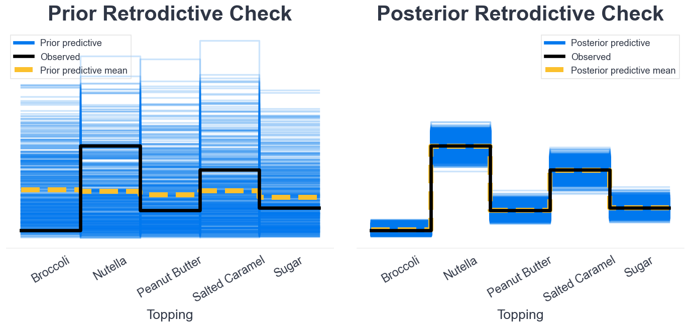
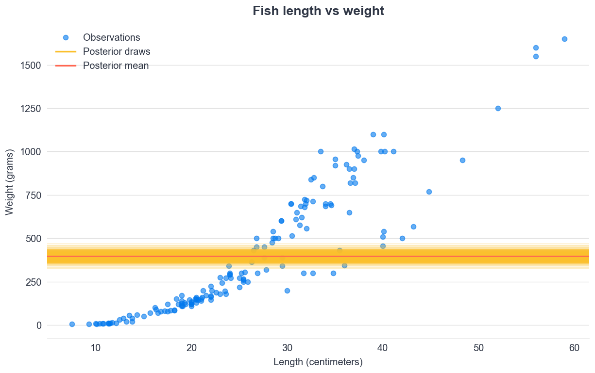

---
jupyter:
  jupytext:
    formats: ipynb,md
    text_representation:
      extension: .md
      format_name: markdown
      format_version: '1.3'
      jupytext_version: 1.13.8
  kernelspec:
    display_name: Python 3 (ipykernel)
    language: python
    name: python3
---

<!-- #region slideshow={"slide_type": "slide"} -->
# Counting Things
<!-- #endregion -->

```python slideshow={"slide_type": "skip"}
import arviz as az
import bambi as bmb
import numpy as np
import pandas as pd
import pymc as pm
from scipy import special, stats
from matplotlib.lines import Line2D
import matplotlib.pyplot as plt
import matplotlib.ticker as mticker

plt.style.use("intuitivebayes.mplstyle")
FIGSIZE = (16, 8)
```

```python slideshow={"slide_type": "skip"}
def adjust_lightness(color, amount=0.5):
    import colorsys

    import matplotlib.colors as mc

    try:
        c = mc.cnames[color]
    except:
        c = color
    c = colorsys.rgb_to_hls(*mc.to_rgb(c))
    return colorsys.hls_to_rgb(c[0], c[1] * amount, c[2])


def plot_ppc_discrete(idata, bins, ax, group):
    def add_discrete_bands(x, lower, upper, ax, **kwargs):
        for i, (l, u) in enumerate(zip(lower, upper)):
            s = slice(i, i + 2)
            ax.fill_between(x[s], [l, l], [u, u], **kwargs)

    var_name = list(idata.observed_data.data_vars)[0]
    y_obs = idata.observed_data[var_name].to_numpy()

    counts_list = []
    for draw_values in az.extract(idata, group)[var_name].to_numpy().T:
        counts, _ = np.histogram(draw_values, bins=bins)
        counts_list.append(counts)
    counts_arr = np.stack(counts_list)

    qts_90 = np.quantile(counts_arr, (0.05, 0.95), axis=0)
    qts_70 = np.quantile(counts_arr, (0.15, 0.85), axis=0)
    qts_50 = np.quantile(counts_arr, (0.25, 0.75), axis=0)
    qts_30 = np.quantile(counts_arr, (0.35, 0.65), axis=0)
    median = np.quantile(counts_arr, 0.5, axis=0)

    colors = [adjust_lightness("C0", x) for x in [1.8, 1.6, 1.4, 1.2, 0.9]]

    add_discrete_bands(bins, qts_90[0], qts_90[1], ax=ax, color=colors[0])
    add_discrete_bands(bins, qts_70[0], qts_70[1], ax=ax, color=colors[1])
    add_discrete_bands(bins, qts_50[0], qts_50[1], ax=ax, color=colors[2])
    add_discrete_bands(bins, qts_30[0], qts_30[1], ax=ax, color=colors[3])

    ax.step(bins[:-1], median, color=colors[4], lw=2, where="post")
    ax.hist(y_obs, bins=bins, histtype="step", lw=2, color="black", align="mid")
    handles = [
        Line2D([], [], label="Observed data", color="black", lw=2),
        Line2D(
            [],
            [],
            label=f"{group.split('_')[0].title()} predictive median",
            color=colors[4],
            lw=2,
        ),
    ]
    ax.legend(handles=handles)
    return ax
```

```python slideshow={"slide_type": "skip"}
pm.__version__
```

<!-- #region slideshow={"slide_type": "slide"} -->
## Restaurants, Houses, Football, and Fish (again)
<!-- #endregion -->

<!-- #region slideshow={"slide_type": "notes"} -->
What do these things have in common? They all have counts. They're also the examples in this lesson. In this lesson we're covering Poisson regressions, which is a distribution typically used for counts.


<!-- #endregion -->

<!-- #region slideshow={"slide_type": "slide"} -->
## Counting Things
The most basic form of statistics
<!-- #endregion -->

<!-- #region slideshow={"slide_type": "slide"} -->
## Count Regressions
Introducing a new link function
<!-- #endregion -->

<!-- #region slideshow={"slide_type": "slide"} -->
## Poisson Distributions in Sports
How many goals can we expect from a team
<!-- #endregion -->

<!-- #region slideshow={"slide_type": "slide"} -->
## Soccer Statistics
How can we estimate the number of goals from data
<!-- #endregion -->

<!-- #region slideshow={"slide_type": "slide"} -->
## Home Field Advantage
Do teams perform better at home or when they're away?
<!-- #endregion -->

<!-- #region slideshow={"slide_type": "slide"} -->
## Zero Inflated Poisson
How do we model a team that doesn't show up over half the time?
<!-- #endregion -->

<!-- #region slideshow={"slide_type": "slide"} -->
## Zero Inflated Fish
End and to End example, including model comparison!
<!-- #endregion -->

<!-- #region slideshow={"slide_type": "slide"} -->
# Counting Things
The most basic form of statistics
<!-- #endregion -->

<!-- #region jp-MarkdownHeadingCollapsed=true slideshow={"slide_type": "slide"} -->
## What mathematics did we learn first?
<!-- #endregion -->

<center>
  
</center>

<!-- #region slideshow={"slide_type": "slide"} -->
## Counts  Are Everywhere

  * Customers a day
  * Students who signed up for this course
  * Goals in game
  * Cars that pass an intersection in day
  * The number of stars in the sky
  * The number of soldiers in the Prussian army killed accidentally by horse kick around 1898
<!-- #endregion -->

<!-- #region slideshow={"slide_type": "notes"} -->
There so many situations where counts occur, and many times we are interested in a count. Let's dive into some numbers.
<!-- #endregion -->

<!-- #region jp-MarkdownHeadingCollapsed=true slideshow={"slide_type": "slide"} -->
## Restaurant Visitors
<!-- #endregion -->

<center>
  
</center>

<!-- #region slideshow={"slide_type": "notes"} -->
Let's assume you have a restaurant, and to make things easy, let's say you want to estimate how many people come in between 12 and 1 for lunch. We ignore holidays and the such. What might the numbers look like?

The first day around 40 people show up. The next day 39 show up, maybe then 37 show up, 42, 45, so on an so forth.

However we never hope 0 people to show up, though that's possible, and we don't expect 45 and a half people to show up. After all you're running a fine establishment and it would be quite offensive to label anyone as half a person.
<!-- #endregion -->

<!-- #region jp-MarkdownHeadingCollapsed=true slideshow={"slide_type": "slide"} tags=[] -->
## What do counts look like (probabilistically) 
<!-- #endregion -->

```python hide_input=false slideshow={"slide_type": "-"}
x_natural = np.arange(0, 80)
λ = 40
poisson_draws = stats.poisson(λ).rvs(365 * 2)

value_counts = pd.Series(poisson_draws).value_counts()
fig, ax = plt.subplots(figsize=FIGSIZE)

ax.bar(value_counts.index, value_counts.values)
ax.set_xlabel("Number of Customers arriving between 12 PM and 1 PM")
ax.set_ylabel("Number of times we have seen \n this many customers")
ax.set_xticks(x_natural[::2])
ax.set_xlim(15, 65)

ax.set_title("Number of visitors during the lunch hour at your popular restaurant")
ax.tick_params(axis="x", rotation=0);
```

<!-- #region slideshow={"slide_type": "notes"} -->
Now let's say you do this for 2 years. You'll get a graph that looks like this. Around 40 customers show up a day. Notice I didn't say on average because I want to bring up a key point.

This graph looks almost like a normal distribution, but it is not because we only have values at natural number integers, and we don't have decimals. It'd be real weird if 43.2 people showed up on a particular day. After all this isn't a hospital or morgue, but dark jokes aside, let's get back to our restaurant
<!-- #endregion -->

<!-- #region jp-MarkdownHeadingCollapsed=true slideshow={"slide_type": "slide"} tags=[] -->
## A less popular restaurant
<!-- #endregion -->

```python hide_input=false
x_natural = np.arange(0, 80)
λ = 1
poisson_draws = stats.poisson(λ).rvs(365 * 2)

value_counts = pd.Series(poisson_draws).value_counts()
fig, ax = plt.subplots(figsize=FIGSIZE)

ax.bar(value_counts.index, value_counts.values)
ax.set_xlabel("Number of Customers arriving between 12 and 1 ")
ax.set_ylabel("Number of times we have seen \n this many customers")
ax.set_xticks(np.arange(-5, 10))
ax.set_xlim(-5, 10)

ax.set_title(
    "Number of visitors during the lunch hour \n at a not so popular restaurant"
)


ax.tick_params(axis="x", rotation=0);
```

<!-- #region slideshow={"slide_type": "notes"} -->
Now let's got to a much less popular restaurant. Perhaps this restaurant only serves crepes with broccoli. We already know how gross this is from Alex's lesson. Here's what the counts look like now. A lot of zeros on the left and not much going on on the right. 

We include negative numbers here to reinforce a point. Poisson 
<!-- #endregion -->

<!-- #region jp-MarkdownHeadingCollapsed=true slideshow={"slide_type": "slide"} -->
## Siméon Denis Poisson and his distribution
<!-- #endregion -->


<!-- #region slideshow={"slide_type": "notes"} -->
What you just saw was plots of samples from a Poisson distribution.

To model distributions we need to become friends with this guy. Oh wait not him, that's Gauss, we mean this guy, Poisson. But some argue this distribution should be called the Moivre distribution because Abraham de Moivre figured it out first, but everyone calls it the Poisson distribution so, sorry Abraham.
<!-- #endregion -->

<!-- #region jp-MarkdownHeadingCollapsed=true slideshow={"slide_type": "slide"} -->
## Gaussian distribution versus Poisson distribution
<!-- #endregion -->

```python
norm_samples = stats.norm(1, 5).rvs(10)
poisson_samples = stats.poisson(3).rvs(10)

print(f"Normal Samples: {norm_samples}")
print(f"Poisson Samples: {poisson_samples}")
```

<!-- #region slideshow={"slide_type": "notes"} -->
To better understand the Poisson distribution lets compare it to one you're well familiar with already, which is the Normal or Gaussian distribution

The Normal distribution has values that are real numbered, meaning they have decimals, and also ones that are negative. In our restaurant example it didn't make sense to have negative numbers, and it also didn't make sense to have numbers that were 1.2323 

Poisson distributions model the distribution that you first learned.  That is counting 0, 1, 2, 3, 4, 5,. These are called natural numbers that start at zero and go up, and all make sense for customer count.
<!-- #endregion -->

<!-- #region jp-MarkdownHeadingCollapsed=true slideshow={"slide_type": "slide"} tags=[] -->
## Binomial Versus Poisson
<!-- #endregion -->

```python
binomial_samples = stats.binom(p=0.5, n=5).rvs(10)
poisson_samples = stats.poisson(3).rvs(10)

print(f"Binomial Samples: {binomial_samples}")
print(f"Poisson Samples: {poisson_samples}")
```

<!-- #region slideshow={"slide_type": "notes"} -->
Now you may be saying "We modeled counts before in the link functions lesson right?" And you'd be right. We used the Binomial distribution to count the number of customers or voters. But there was an important difference, we had a fixed numbers of trials, which was a parameter to the distribution. The number of trials puts a ceiling on the count (you cannot have more successes than trials). 

Now showing up to a reservation is still a count. But it's a different nature. You're seeing each trial (each person) and you record whether the person shows up (success) or not (failure).

With Poisson distributions there are no fixed upper bounds to trials or counts.
<!-- #endregion -->

<!-- #region jp-MarkdownHeadingCollapsed=true slideshow={"slide_type": "slide"} tags=[] -->
##  Plotting the Poisson distribution
<!-- #endregion -->

```python
x_natural = np.arange(0, 15)
λ = 3
pmf = stats.poisson.pmf(x_natural, λ)
```

```python hide_input=true
fig, ax = plt.subplots(figsize=FIGSIZE)

ax.bar(x_natural, pmf, label="$\lambda$ (lambda) = {}".format(λ))
ax.set_xlabel("x - Any arbitrary count of anything")
ax.set_ylabel("p(x) - Probability of seeing that count")
ax.set_ylim(0)
ax.set_xticks(x_natural)
ax.legend(loc=1);
```

<!-- #region slideshow={"slide_type": "notes"} -->
Let's plot our Poisson distribution over a range of values. On the bottom you'll see the same natural numbers. You'll also notice a subtle change on the y axis. This time its decimals, and in fact it is now proper probabilities. Previously we had seen counts of samples on the y axis, so technically that wasn't a Poisson distribution but rather samples from a Poisson distribution random number generator. The nit is minor but an important one.

Another thing you may have noticed that Poisson distributions are quite simple to parameterize having just one parameter. Often this is denoted as lambda. Let's now change this parameter and see what happens.

Though the parameter symbol doesn't matter you'll often also see the $\lambda$ be used in literature as we've showed here.
<!-- #endregion -->

<!-- #region jp-MarkdownHeadingCollapsed=true slideshow={"slide_type": "slide"} tags=[] -->
## Poisson Parameterization 
<!-- #endregion -->

```python hide_input=false
fig, ax = plt.subplots(figsize=FIGSIZE)
x_natural = np.arange(0, 20)


for i, m in enumerate([0.5, 3, 8, 12]):
    pmf = stats.poisson.pmf(x_natural, m)
    ax.plot(x_natural, pmf, "-o", label="$\lambda$ = {}".format(m))

ax.set_xlabel("x")
ax.set_ylabel("p(x)")
ax.set_ylim(0)
ax.set_xticks(x_natural)
ax.legend(loc=1);
```

<!-- #region slideshow={"slide_type": "notes"} -->
Here's is the Poisson distribution with a couple of different parameter values. In this visualization we add the line to show continuity but again note that only observations at the dots at possible.

Note how as lambda gets larger the distribution both shifts to the right, and becomes "more normal". I want to stress again this does not mean the Poisson and normal/Gaussian distributions are the same though sometimes you'll see it referred as such.
<!-- #endregion -->

<!-- #region jp-MarkdownHeadingCollapsed=true slideshow={"slide_type": "slide"} -->
## Parameter domain must be real valued positive
<!-- #endregion -->

```python slideshow={"slide_type": "-"}
λ = 3.1454
x = [1, 2, 3, 4]
pmf_real = stats.poisson.pmf(x, 3.1454)
pmf_real
```

```python slideshow={"slide_type": "fragment"}
λ = -1
pmf_negative = stats.poisson.pmf(x, -1)
pmf_negative
```

<!-- #region slideshow={"slide_type": "notes"} -->
Another thing to note is that the lambda parameter must be real valued positive. Since counts are always 0 or greater, the mean can never be negative. However, unlike counts, the mean can be real as for example is the mean of 3, 4, and 6
<!-- #endregion -->

<!-- #region jp-MarkdownHeadingCollapsed=true slideshow={"slide_type": "slide"} -->
## Probability Mass Function
<!-- #endregion -->

$$
f(k; \lambda) = \Pr(X{=}k)= \frac{\lambda^k e^{-\lambda}}{k!}
$$

```python
_lambda = 3
k = obs = 4

_lambda**obs * np.exp(-_lambda) / special.factorial(obs)
```

```python
stats.poisson(_lambda).pmf(k)
```

<!-- #region slideshow={"slide_type": "notes"} -->
For you mathematicians this is the formula for the probability mass function. Realize I say mass, not density, because this is discrete. To show you the formula, math and library calculations are equivalent here are all three together.
<!-- #endregion -->

<!-- #region jp-MarkdownHeadingCollapsed=true slideshow={"slide_type": "slide"} -->
## Mean and Variance Poisson Distribution
<!-- #endregion -->

```python
lambdas = [0.5, 3.0, 10.0]

for _lambda in lambdas:
    samples = stats.poisson(_lambda).rvs(10_000)
    print(f"Lambda {_lambda}. Mean {samples.mean()}, Variance {samples.var():.3f}")
```

<!-- #region slideshow={"slide_type": "notes"} -->
One parameter controls the mean of the distribution, but it also affects the variance. This isn't something we need to worry about now but we'll come back to this point later, in particular how this single parameter can be too restrictive to model some phenomena.
<!-- #endregion -->

<!-- #region slideshow={"slide_type": "slide"} -->
## Section Recap
* Counts show up often in real life
  * Counts are referred to as natural numbers (0, 1, 2, 3..)
* Poisson distributions are distributions over natural numbers
* Poisson distributions only have one parameter which 
  * Controls both their mean and variance
  * Must be positive
  * Can be real valued (1.234, 2.32)
  * This parameter is often shown as $\lambda$ or $\mu$
<!-- #endregion -->

<!-- #region jp-MarkdownHeadingCollapsed=true slideshow={"slide_type": "slide"} tags=[] -->
# Count Regressions
With the magic of log link functions
<!-- #endregion -->

<!-- #region slideshow={"slide_type": "notes"} -->
At this point you know what's coming next. We want to take a Poisson model and generalize it in a regression.
Let's jump straight into it with a log link function.
<!-- #endregion -->

<!-- #region slideshow={"slide_type": "slide"} -->
## Estimating the number of rooms in a home from a home's price
<!-- #endregion -->

<center>
  
</center>

<!-- #region slideshow={"slide_type": "notes"} -->
Now that were experts on both the Poisson distribution let's put this in an applied regression. 

Let's now model the number of rooms someone's home has as a function of their house price. This is a classic model for Poisson GLMs because the covariate is continuous but the outcome has to be discrete.
<!-- #endregion -->

<!-- #region slideshow={"slide_type": "slide"} -->
## Number of rooms and house price
<!-- #endregion -->

```python slideshow={"slide_type": "skip"}
# this code is hidden
income_rooms = (
    (100_010, 1),
    (120_123.45, 1),
    (90_012, 1),
    (300_12.23, 2),
    (300_000, 2),
    (351_323, 3),
    (587_101.12, 4),
    (500_000, 4),
    (500_000, 4),
    (500_000, 4),
    (1_201_022.12, 9),
    (1_000_000, 10),
)
house_df = pd.DataFrame(income_rooms, columns=("HousePrice", "Rooms"))
```

```python
house_df
```

<!-- #region slideshow={"slide_type": "slide"} -->
## A Linear Poisson model
<!-- #endregion -->

```python
with pm.Model() as home_model:
    slope = pm.Normal("slope", 100, 100)
    intercept = pm.Normal("intercept", 100, 100)

    μ = intercept + slope * house_df["HousePrice"].values

    rooms = pm.Poisson("Rooms", μ, observed=house_df["Rooms"].to_numpy())
```

<!-- #region slideshow={"slide_type": "notes"} -->
Let's make a linear model. You've seen this many times now but pause here, do you think this is going to fail and why? 
<!-- #endregion -->

<!-- #region slideshow={"slide_type": "slide"} -->
## Get some samples
<!-- #endregion -->

```python
with home_model:
    idata_homes = pm.sample()
```

<!-- #region slideshow={"slide_type": "notes"} -->
At this point in the course you should know PyMC is telling us sampling didn't work. Why do we have divergences? Well, look back at the model. Do you notice anything? Our model allows for houses with a negative number of rooms. That is nonsensical. 
<!-- #endregion -->

<!-- #region slideshow={"slide_type": "slide"} -->
## Confirming with a traceplot
<!-- #endregion -->

```python
az.plot_trace(idata_homes);
```

<!-- #region slideshow={"slide_type": "notes"} -->
We can confirm with a trace plot. It's why you're seeing the black lines on the bottom. 

Our specific issue here is that our model is allowing for negative values of the 

These are showing up as divergences, which occur when the MCMC sampler is seeing an "issue" with parameters under the hood.
If unfamiliar with Hamiltonian Monte Carlo the basic takeaway is if you see too many of these there's an issue that needs to be addressed. If you are familiar it means the simulated trajectory departed from the true trajectory as measured by departure of the Hamiltonian value from its initial value.

Either way it means in this case we need to change our model.
<!-- #endregion -->

<!-- #region slideshow={"slide_type": "slide"} -->
## The Log, and Exp Inverse, Link Function
<!-- #endregion -->

```python
fig, ax = plt.subplots()

x = np.linspace(-10, 10)
ax.set_xlabel("Untransformed Space")
ax.set_ylabel("Transformed Space")

ax.plot(x, np.exp(x));
```

<!-- #region slideshow={"slide_type": "notes"} -->
Remember how the parameter for the link function had to be positive? Well, the exponential transformation lets us do exactly that. That's why it's so handy to turn linear space into a parameter space we can use to plug into the Poisson model.
<!-- #endregion -->

<!-- #region slideshow={"slide_type": "skip"} -->
## Why log link?
<!-- #endregion -->

<!-- #region slideshow={"slide_type": "skip"} -->
$$
\begin{align*}
    g(\mu) &= b_{0} + b_{1}x_{1} + b_{2}x_{2} \\
    \log(\mu) &= b_{0} + b_{1}x_{1} + b_{2}x_{2} \\
    \mu &= g^{-1}(b_{0} + b_{1}x_{1} + b_{2}x_{2}) \\
    \mu &= e^{(b_{0} + b_{1}x_{1} + b_{2}x_{2})}
\end{align*}
$$

<!-- #endregion -->

<!-- #region slideshow={"slide_type": "skip"} -->
Remember the link function is named after the thing on the left, which in this case is log but in calculation we use the inverse, which is the exponential.

Nonetheless, the functionality is the same as we've seen in previous lessons. We have a regression that outputs values from negative infinity to infinity, and we need a function to transform that into something that is a valid parameter for Poisson distribution, which is exactly what the transformation here is doing.
<!-- #endregion -->

<!-- #region slideshow={"slide_type": "slide"} -->
## Generalized Poisson in PyMC
<!-- #endregion -->

```python
with pm.Model() as home_model:
    intercept = pm.Normal("intercept", 100, 100)
    slope = pm.Normal("slope", 100, 100)

    μ = intercept + slope * house_df["HousePrice"].to_numpy()

    # This is the inverse link function
    λ = np.exp(μ)

    rooms = pm.Poisson("Rooms", λ, observed=house_df["Rooms"].to_numpy())
```

<!-- #region slideshow={"slide_type": "notes"} -->
So far so good right? We only have one covariate and intercept. And with only one parameter needed the linear predictor becomes quite simple as well. Way simpler than all the pivot, ZeroSumNormal stuff Alex was doing in his lesson.
<!-- #endregion -->

<!-- #region slideshow={"slide_type": "slide"} -->
## Sampling still fails?
<!-- #endregion -->

```python
with home_model:
    idata_homes = pm.sample()
```

<!-- #region slideshow={"slide_type": "notes"} -->
When we try sampling we get this though! What happened? We used a link function and our model is specified correctly. What's the problem?
<!-- #endregion -->

<!-- #region slideshow={"slide_type": "slide"} -->
## Checking prior predictive samples
<!-- #endregion -->

```python
with home_model:
    priors_unscaled = pm.sample_prior_predictive()
```

<!-- #region slideshow={"slide_type": "notes"} -->
To start with, we should check our prior predictive samples. They usually give us a good hint about potential issues, so we should always start with this.

Well that's interesting: we can't even sample from our prior! Look what PyMC is telling us:
```python
ValueError: lam value too large
Apply node that caused the error: poisson_rv{0, (0,), int64, True}
```

So what does it mean? __The lambda value of the Poisson distribution is too large__, causing a numeric overflow. Does it come from our priors? Or could it be due to the data? Let's investigate!

First try: let's use very small priors, and see if the problem is still here.
<!-- #endregion -->

<!-- #region slideshow={"slide_type": "slide"} -->
## Saturating the link function
<!-- #endregion -->

```python
b_0 = 0
b_1 = 1
house_price = 500_000
np.exp(b_0 + b_1 * house_price)
```

<!-- #region slideshow={"slide_type": "notes"} -->
Bingo, as they say in Las vegas! Turns out it's very easy to saturate the inverse link function. Because our house price numbers are so high, even small coefficients easily overwhelm that exponentiation calculation.

Luckily there's a simple workaround you've already seen in this course... Scaling the data!
<!-- #endregion -->

<!-- #region slideshow={"slide_type": "slide"} -->
## Need to scale
<!-- #endregion -->

```python slideshow={"slide_type": "-"}
# Unscaled Values
house_df["HousePrice"].min(), house_df["HousePrice"].max(), house_df[
    "HousePrice"
].std(), house_df["HousePrice"].mean()
```

```python slideshow={"slide_type": "fragment"}
house_scaled = (house_df["HousePrice"] - house_df["HousePrice"].mean()) / house_df[
    "HousePrice"
].std()
house_scaled.min(), house_scaled.max(), house_scaled.std(), house_scaled.mean()
```

<!-- #region slideshow={"slide_type": "notes"} -->
We just need to mean center and scale the income. This gives us a nice small covariate range and we can proceed with modeling. By reducing the input data range by the time the model sees it, we're less likely to saturate the link function and get a float error.
<!-- #endregion -->

<!-- #region slideshow={"slide_type": "slide"} -->
## Looking at the scaling
<!-- #endregion -->

```python
pd.concat([house_df["HousePrice"], house_scaled], axis=1)
```

<!-- #region slideshow={"slide_type": "notes"} -->
Here's what the scaling looks like side by side with the original house price.
<!-- #endregion -->

<!-- #region slideshow={"slide_type": "slide"} -->
## Scaled House Price Model
<!-- #endregion -->

```python
with pm.Model() as home_model_scaled:
    intercept = pm.Normal("intercept", 100, 100)
    slope = pm.Normal("slope", 100, 100)

    # Mutable data so we can change this later
    _house_scaled = pm.MutableData("HousePrice_scaled", house_scaled.to_numpy())
    μ = intercept + slope * _house_scaled

    # Switch to pm.math
    λ = pm.math.exp(μ)

    rooms = pm.Poisson("Rooms", λ, observed=house_df["Rooms"].to_numpy())

    idata_homes_scaled = pm.sample()
    idata_homes_scaled.extend(pm.sample_prior_predictive())
```

<!-- #region slideshow={"slide_type": "notes"} -->
Let's try it again, with the rescaled covariates. This gets us a restricted range. We also use `pm.math.exp`. The reason for this is that the PyMC version will give you safer numerical compute than the numpy one. Interesting! Now we _can_ sample, but still can't get prior predictive samples. So it turns out both our hypotheses were right! What to do now...? Well, what about thinking?
<!-- #endregion -->

<!-- #region slideshow={"slide_type": "slide"} -->
## What else do we know about houses?
<!-- #endregion -->

```python slideshow={"slide_type": "fragment"}
np.log(2)
```

<!-- #region slideshow={"slide_type": "fragment"} -->
$$
\begin{aligned}
\alpha &\sim \text{Normal}(\log(2), 0.5) \\
\end{aligned}
$$
<!-- #endregion -->

<!-- #region slideshow={"slide_type": "notes"} -->
$\exp(\text{intercept})$ __is the average number of rooms for a house with price 0__. In theory, it doesn't mean a lot (having lived a few years on this Earth, I can confidently say a free house is a house with no rooms!). What you're actually looking at a picture a house with no rooms right now. not very impressive.


But let's get back to the math. Now that we've standardized the data, the mean of prices is 0, so a house with price 0 is actually a house with average price. That's useful domain knowledge we can use to set our priors !

Now, I've never bought a house, but I suspect an average-priced house has ±2 rooms. So we want the logarithm of 2 as our mean, since we're gonna take the exponential:

We have our prior for the mean intercept. For the standard deviation, using something like 0.5 should be a good start, given the exponential link.

<!-- #endregion -->

<!-- #region slideshow={"slide_type": "slide"} -->
## Both Priors together
<!-- #endregion -->

$$
\begin{aligned}
\alpha &\sim \text{Normal}(\log(2), 0.5) \\
\beta &\sim \text{Normal}(0, 0.2)
\end{aligned}
$$

<!-- #region slideshow={"slide_type": "notes"} -->

Now what about the slope? We could already include our prior knowledge that number of rooms and prices are positively correlated (i.e setting the mean of the slope to some positive number). But let's keep it simple for now, and only add complexity to our model if we don't need to (parsimony...).

As a rule of thumb, the prior standard deviation on the slope should be lower than the one on the intercept (because the intercept captures most of the variation, and the slope only regulates down or up from that baseline). As a result, 0.2 should be a good start.

So, to sum up here's our priors. And the rest of the model is unchanged
<!-- #endregion -->

<!-- #region slideshow={"slide_type": "slide"} -->
## A rescaled scaled House Price Model with new priors
<!-- #endregion -->

```python
with pm.Model() as home_model_scaled:
    intercept = pm.Normal("intercept", pm.math.log(2), 0.5)
    slope = pm.Normal("slope", 0, 0.2)

    # mutable data so we can change this later of needed
    # useful for predictions
    _house_scaled = pm.MutableData("HousePrice_scaled", house_scaled.to_numpy())
    μ = intercept + slope * _house_scaled

    # Switch to pm.math
    λ = pm.math.exp(μ)

    rooms = pm.Poisson("Rooms", λ, observed=house_df["Rooms"].to_numpy())

    idata_homes_scaled = pm.sample()
    idata_homes_scaled.extend(pm.sample_prior_predictive())
```

<!-- #region slideshow={"slide_type": "notes"} -->
Everything works now -- that's good sign! As they say in French though: let's not sell the bear's skin _before_ actually killing it. So, what does our prior predictive samples look like (at this point in the course, I hope you had that reflex before I mentioned it ;))
<!-- #endregion -->

<!-- #region slideshow={"slide_type": "slide"} -->
## Check prior predictives
<!-- #endregion -->

```python
az.plot_ppc(idata_homes_scaled, group="prior", observed=False);
```

<!-- #region slideshow={"slide_type": "notes"} -->
Well that looks really good, don't you think? Our prior makes sense but is still quite diffuse, to not bias the model. Let's check convergence now.
<!-- #endregion -->

<!-- #region slideshow={"slide_type": "slide"} -->
## Check Diagnostics Again
<!-- #endregion -->

```python
az.plot_trace(idata_homes_scaled);
```

<!-- #region slideshow={"slide_type": "notes"} -->
Finally! No divergences and a traceplot that looks good. We can go ahead and make predictions.
<!-- #endregion -->

<!-- #region slideshow={"slide_type": "slide"} -->
## Predicted number of rooms per income level
<!-- #endregion -->

```python
new_house = 500_000

# Scale the data
house_scaled_new = (new_house - house_df["HousePrice"].mean()) / house_df[
    "HousePrice"
].std()
```

<!-- #region slideshow={"slide_type": "notes"} -->
Now let's estimate the probability of the number of rooms given a house costs 500k. We first need to input 500k, taking care to scale it so the coefficients match what we used in the regression. Note it's important to use the same scaler present in the data we used to train the model, it's a classic machine learning mistake to have your scaler change as new data comes in.

<!-- #endregion -->

<!-- #region slideshow={"slide_type": "slide"} -->
## Predicted Rooms Plot
<!-- #endregion -->

```python
with home_model_scaled:
    pm.set_data({"HousePrice_scaled": (house_scaled_new,)})
    ppc_500k = pm.sample_posterior_predictive(idata_homes_scaled)
```

```python hide_input=false
fig, ax = plt.subplots(figsize=FIGSIZE)

az.plot_dist(ppc_500k.posterior_predictive.Rooms)
ax.set_xlabel("Count of Rooms")
ax.set_ylabel("Probability")
ax.set_xlim(-.5, 20)
ax.set_title("Prediction for $500k house");
```

<!-- #region slideshow={"slide_type": "notes"} -->

(remember that we need to scale the data because if we don't, our inverse link function may saturate and we won't get a proper results).
<!-- #endregion -->

<!-- #region slideshow={"slide_type": "slide"} -->
## We're now millionaires
<!-- #endregion -->

```python
new_house = 1_000_000
house_scaled_new = (new_house - house_df["HousePrice"].mean()) / house_df[
    "HousePrice"
].std()

with home_model_scaled:
    pm.set_data({"HousePrice_scaled": (house_scaled_new,)})

    ppc_1million = pm.sample_posterior_predictive(idata_homes_scaled)
```

<!-- #region slideshow={"slide_type": "skip"} -->
From all the things we've learned in this course we are now rich and can afford a million dollar house. We can set 1 million in our sampler and take posterior predictive samples.
<!-- #endregion -->

<!-- #region slideshow={"slide_type": "slide"} -->
## Plotting Side by Side
<!-- #endregion -->

```python hide_input=false
fig, ax = plt.subplots(figsize=FIGSIZE)


def ppc_to_prob_vector(idata_ppc):
    s = pd.Series(idata_ppc.posterior_predictive.Rooms.values.ravel()).value_counts()
    return s.div(s.sum())


house_ppc_df = pd.DataFrame(
    {
        "500k House Price": ppc_to_prob_vector(ppc_500k),
        "1 Million House Price": ppc_to_prob_vector(ppc_1million),
    }
)

house_ppc_df.plot(kind="bar", ax=ax)

ax.set_xlabel("Count of Rooms")
ax.set_ylabel("Posterior Predictive Probability")
ax.set_xticklabels(ax.get_xticks(), rotation=0)
ax.set_xlim(-1, 30);
```

<!-- #region slideshow={"slide_type": "notes"} -->
Now we can see the difference from our 500k homes to our 1 million dollar home. A 500k house price is very likely to have between 0 and 2 rooms, while a 1 million dollar house will almost surely have at least 3 or 4 rooms. I don't know about you, but I find that quite pricey!
<!-- #endregion -->

<!-- #region slideshow={"slide_type": "slide"} -->
## Link Function Master
<!-- #endregion -->

<center>
  
</center>

<!-- #region slideshow={"slide_type": "notes"} -->
At this point you're a master of link functions. This was the last new one we're introducing this course. We'll be using this newfound knowledge to dive into some real world examples. We'll get to that right after the section recap.
<!-- #endregion -->

<!-- #region slideshow={"slide_type": "slide"} -->
## Section Recap
<!-- #endregion -->

* Linear predictors need transformation when used with Poisson likelihood
  * The input parameter range must be restricted from 0 to infinity
* The inverse link function is exponentiation
  * Due to this computation Poisson models tend to oversaturate easily causing floating point problems
  * Scaling is an easy trick to keep numbers "small" so computation doesn't fail

<!-- #region slideshow={"slide_type": "slide"} -->
# Poisson Distributions in Sports
The goal of this lesson? Show you many examples
<!-- #endregion -->

<!-- #region slideshow={"slide_type": "notes"} -->
Let's dive into some real world data, focusing first on understanding it before we get to the models.
<!-- #endregion -->

<!-- #region slideshow={"slide_type": "slide"} -->
## Now lets talk about football


<center>
  
</center>
<!-- #endregion -->

<!-- #region slideshow={"slide_type": "notes"} -->
Oh not this football, I'm American so I forgot that this isn't the sport anyone cares about, or the one that makes sense.
<!-- #endregion -->

<!-- #region slideshow={"slide_type": "slide"} -->
## Let's talk about (real) football
<center>
  
</center>
<!-- #endregion -->

<!-- #region slideshow={"slide_type": "notes"} -->
That's right, this one, the one you play with your feet. The goal of this game is to well, score goals, and we're going to analyze just that. How many goals does a team score and what other insights can we produce from the data?
<!-- #endregion -->

<!-- #region slideshow={"slide_type": "slide"} -->
## Premier League Data
<!-- #endregion -->

```python
raw_football_df = pd.read_csv("data/season-1718.csv")
raw_football_df.head()
```

<!-- #region slideshow={"slide_type": "notes"} -->
Now we're going to do what you should have totally expected. Exploratory analysis to see what we're working with. Let's first subset to the data, clean up the columns, 

Here's the data from the English premier league from the 2017-2018 season. There are many columns of data but we're going to ignore most of them. For this section, we're going to focus just on the goals, which are labeled `FTHG` for home team goals, and `FTAG` for away team goals.
<!-- #endregion -->

<!-- #region slideshow={"slide_type": "slide"} -->
## Data Cleanup and EDA
<!-- #endregion -->

<!-- #region slideshow={"slide_type": "notes"} -->
Let's reformat the data to make it easier to use. We see we have 380 rows -- one for each game.

In the exercises, we'll want to measure team performance as a function of time in the season as well so we might as well add that now (`days_since_first_game`).
<!-- #endregion -->

```python
raw_football_df.rename(
    {"FTHG": "goals_home", "FTAG": "goals_away"}, axis=1, inplace=True
)

# Change to datetime format
raw_football_df["Date"] = pd.to_datetime(raw_football_df["Date"], format="%d/%m/%y")
first_game = raw_football_df["Date"].min()
raw_football_df["days_since_first_game"] = (
    raw_football_df["Date"] - first_game
).dt.days

# Select columns that are needed
subset_raw_football_df = raw_football_df.iloc[:, [2, 3, 4, 5, -1]].rename(
    columns={"HomeTeam": "home_team", "AwayTeam": "away_team"}
)

subset_raw_football_df
```

<!-- #region slideshow={"slide_type": "slide"} -->
## Individual teams
<!-- #endregion -->

<!-- #region slideshow={"slide_type": "notes"} -->
Lets take a look to verify we got all the teams.
<!-- #endregion -->

```python
teams = subset_raw_football_df["home_team"].unique()
teams
```

```python slideshow={"slide_type": "fragment"}
teams.shape
```

Looks like we have all 20 so were good to go! Just for fun we can use itertools to see how many permutations there are, that if every team plays two games against every other team how many games we get?

```python slideshow={"slide_type": "fragment"}
from itertools import permutations

len(list(permutations(teams, 2)))
```

And what do you know! It happens to be 380, same shape as our previous dataframe.

<!-- #region slideshow={"slide_type": "slide"} -->
## More reshaping
<!-- #endregion -->

<!-- #region slideshow={"slide_type": "notes"} -->
Let's rearrange the columns to make it easier for analysis, we want all the goals in one column to be represented by a categorical column of game type. We don't care so much who they were playing against.
<!-- #endregion -->

```python
home_goals = (
    subset_raw_football_df[["home_team", "goals_home", "days_since_first_game"]]
    .assign(GameType="Home")
    .rename({"home_team": "Team", "goals_home": "Goals"}, axis=1)
)
away_goals = (
    subset_raw_football_df[["away_team", "goals_away", "days_since_first_game"]]
    .assign(GameType="Away")
    .rename({"away_team": "Team", "goals_away": "Goals"}, axis=1)
)

long_football_df = pd.concat([home_goals, away_goals], axis=0)
long_football_df.head()
```

<!-- #region slideshow={"slide_type": "slide"} -->
## Total Goals Per Team
<!-- #endregion -->

Let's first answer the most burning question, let's see which team got the most goals. Pandas makes that simple and here's the plot. 

```python hide_input=true
fig, ax = plt.subplots(figsize=FIGSIZE)
long_football_df[["Team", "Goals"]].groupby("Team").sum().sort_values(
    by="Goals", ascending=False
).plot(kind="barh", ax=ax)

ax.bar_label(ax.containers[0]);
```

<!-- #region slideshow={"slide_type": "notes"} -->
Clearly, Manchester City is dominating.
<!-- #endregion -->

<!-- #region slideshow={"slide_type": "slide"} -->
## Manchester City Goal Distribution
<!-- #endregion -->

```python hide_input=true
fig, ax = plt.subplots(figsize=FIGSIZE)
az.plot_dist(long_football_df.query("Team == 'Man City'")["Goals"], ax=ax)
ax.set_xlabel("Goal Count")
ax.set_ylabel("Observed Proportion")
ax.set_title("Manchester City goals per match in the season");
```

<!-- #region slideshow={"slide_type": "notes"} -->
We also can plot a barplot of goals scored per game. Manchester City seems to score 3 goal pretty often, with a drop off on both higher and lower numbers. At first glance this distribution looks "normalish".

Also note that there are no negative numbers. Neither are there decimals, fractions, or anything else of the like.
<!-- #endregion -->

<!-- #region slideshow={"slide_type": "slide"} -->
##  Comparing Goal Distributions
<!-- #endregion -->

```python hide_input=true
fig, ax = plt.subplots(figsize=FIGSIZE)

(
    long_football_df.query("Team in ('Man City','Huddersfield') ")[
        ["Team", "Goals"]
    ]  # Filter teams
    .groupby(["Goals", "Team"])
    .size()  # Aggregate number occurences of invidual goal count
    .reset_index()
    .pivot(index="Goals", columns="Team")  # Reshape with teams as columns
    .droplevel(0, axis="columns")  # Make the colums nice
    .plot(kind="bar", ax=ax)
)  # Plot side by side bar chart

ax.set_xlabel("Number of Goals in One Game")
ax.set_ylabel("Count of games \n with this specific goal count")
ax.tick_params(axis="x", rotation=0)

y_locator = mticker.MaxNLocator(integer=True)
ax.yaxis.set_major_locator(y_locator)
```

<!-- #region slideshow={"slide_type": "notes"} -->
In this case we compare the best and worst teams. We can see some clear differences. Clearly Manchester City scores a lot more goals. We also can see some differences in the shape of the distribution. Huddersfield is much more "squished" to the left. 

This generally makes sense if a team is not good at scoring goals we wouldn't expect to see a bunch of "low" scores, and then high scores.

Now most data analysts would stop here, but because we're Bayesian statisticians we can dive in much deeper.
<!-- #endregion -->

<!-- #region slideshow={"slide_type": "slide"} -->
## Section Recap
* We're going to be analyzing football, or soccer, goal data
  * Loaded our data into memory
  * Performed some data cleaning
* We are focusing on three covariates
    * Team
  * Home or Away
  * Days since start of season
* Through EDA we notice different teams have different levels of performance
<!-- #endregion -->

#  Soccer Statistics

<!-- #region slideshow={"slide_type": "slide"} -->
Using our new modeling capability
<!-- #endregion -->

<!-- #region slideshow={"slide_type": "slide"} -->
## AKA Soccer Statistics
<!-- #endregion -->

<!-- #region slideshow={"slide_type": "-"} -->
<center>
  
</center>
<!-- #endregion -->

<!-- #region slideshow={"slide_type": "notes"} -->
We can do soccer statistics. And yes I switched back to the American word so I can make this sound fancy, but don't get distracted. Using the methodologies we've learned in this course we can estimate uncertainty, predict the future, make inferences, and understand relationships.

All we need to do is use our new likelihood and link function!
<!-- #endregion -->

<!-- #region slideshow={"slide_type": "slide"} -->
## The properties of goals
<!-- #endregion -->

<center>
  
</center>

<!-- #region slideshow={"slide_type": "notes"} -->
Goals as most folks know, are just counts. And what's more, there's no upper bound for the number of goals you can score! It only depends on how good you are (yes, we're making lots of simplifications). It also depends on the ability of the other team, it's constrained by time, etc.

Now we know that as people, but a statistics model doesn't know that. A common mistake I see junior statisticians make is just picking a Gaussian distribution, or even worse, just using the defaults of a package. Let's do that to see where we go wrong.
<!-- #endregion -->

<!-- #region slideshow={"slide_type": "slide"} -->
## Counting goals with defaults
<!-- #endregion -->

$$
\begin{aligned}
\beta_{\text{intercept}} & \sim \text{Normal} \\
\mu_i & = \beta_{\text{intercept}} \\
y_i & \sim \text{Normal}(\mu_i)
\end{aligned}
$$

```python
normal_model = bmb.Model("Goals ~ 1", long_football_df.query(f"Team == 'Man City'"))
normal_idata = normal_model.fit()
normal_model.predict(normal_idata, kind="pps")
```

<!-- #region slideshow={"slide_type": "notes"} -->
Lets pretend we forgot everything we've learned in this course since Lesson 3. We'll just let Bambi do its thing for us. We plug in our goal and say we want to estimate the distribution. Because we're doing simple distributional analysis right now we don't have any covariates.
<!-- #endregion -->

<!-- #region slideshow={"slide_type": "slide"} -->
## Plotting our predictions
<!-- #endregion -->

```python
az.plot_ppc(normal_idata);
```

<!-- #region slideshow={"slide_type": "notes"} -->
We can now plot the predictions and hey things don't look too bad. It is a bit weird that we have negative goals, or goals that are 2.323421, but at the picture is looking pretty alright.

Note uncertainty in the posterior predictive distribution is quite large (the overall shape resembles the observed data well). But the "band" is quite thick, meaning individual draws of the posterior predictive distribution are very different.

<!-- #endregion -->

<!-- #region slideshow={"slide_type": "slide"} -->
## Counting Goals for Huddersfield
<!-- #endregion -->

<!-- #region slideshow={"slide_type": "notes"} -->
Let's do the same for Huddersfield. Not too bad to implement, we just swap out the filter.
<!-- #endregion -->

```python
normal_model = bmb.Model("Goals ~ 1", long_football_df.query(f"Team == 'Huddersfield'"))
normal_idata = normal_model.fit()
normal_model.predict(normal_idata, kind="pps")
```

<!-- #region slideshow={"slide_type": "slide"} -->
## The predictions suck
<!-- #endregion -->

```python
az.plot_ppc(normal_idata);
```

<!-- #region slideshow={"slide_type": "notes"} -->
Oof this is looking way worse. Not something I'd want to show my boss, or even my mother. What are we doing wrong?
<!-- #endregion -->

<!-- #region slideshow={"slide_type": "slide"} -->
## What is wrong with the normal distribution
<!-- #endregion -->

```python
stats.norm().rvs(10)
```

<!-- #region slideshow={"slide_type": "notes"} -->
Have you ever seen a team score a goal of 2.1231232?. How about -2.5? Yeah, neither have we. And do you think its makes sense that the goal distribution is always perfectly symmetrical? It doesn't make sense.
<!-- #endregion -->

<!-- #region slideshow={"slide_type": "slide"} -->
## Computers (and models) are dumb
<!-- #endregion -->

<center>
  
</center>

<!-- #region slideshow={"slide_type": "notes"} -->
Here is an AI-generated image of a dumb computer. The picture looks awful, just like our model.
In our Bayesian case by picking a normal distribution this is what the model has to do, assume that negative goals are possible. A normal likelihood makes no sense here.

From common knowledge, we know this is impossible. But a computer doesn't know that. You need to tell it.
<!-- #endregion -->

<!-- #region slideshow={"slide_type": "slide"} -->
## Counting Goals with a categorical likelihood
<!-- #endregion -->

<center>
  
</center>

<!-- #region slideshow={"slide_type": "notes"} -->
What about the shiny new tools of categorical models that Alex just told you all about? Well how many categories should we put in? Do we know a priori how many goals a team will score?

The fact is we don't. But there's an even more subtle issue here. In categorical regression each outcome is independent in a sense. That is they're not related to each other. That doesn't mean its uniform, you saw how much people prefer Nutella to broccoli.

But think about a sports team, if a team wins a lot of games with a score of 3 what do you think the two most likely other numbers are? Probably 2 and 4 right?

A categorical distribution doesn't understand this ordinal relationship.

We have to pre-specify all the possible values of the number of goals... And then the question is what to choose, between 0 and 5? between 0 and 10? between 0 and 100? It can give us all types of headaches to do so.
<!-- #endregion -->

<!-- #region slideshow={"slide_type": "slide"} -->
## Poisson Likelihood Goal Model

$$
\begin{aligned}
\beta_{\text{intercept}} & \sim \text{Normal} \\
\mu_i & = \beta_{\text{intercept}}\\
\lambda_i & = e^{\mu_i} \\
y_i & \sim \text{Poisson}(\lambda_i)
\end{aligned}
$$
<!-- #endregion -->

<!-- #region slideshow={"slide_type": "notes"} -->
Now that we're acquainted with the Poisson distribution let's use Bambi to fit it. Like everything else Bambi makes this quite easy with a one keyword change. We don't even need to specify the link function, since the logarithm is already the default for the Poisson family.
<!-- #endregion -->

```python
manchester_model = bmb.Model(
    "Goals ~ 1", long_football_df.query(f"Team == 'Man City'"), family="poisson"
)
```

<!-- #region slideshow={"slide_type": "slide"} -->
## A deeper dive into the model
<!-- #endregion -->

```python
manchester_model.build()
manchester_model
```

<!-- #region slideshow={"slide_type": "notes"} -->
Since this is our first time using Bambi for Poisson model fitting let's see what's going on one level deeper. Here we get a confirmation of our 38 observations of games, and that this is an intercept-only model, which means we have no covariates. This makes sense since we're just looking at one team.
<!-- #endregion -->

<!-- #region slideshow={"slide_type": "slide"} -->
## Plotting the priors
<!-- #endregion -->

```python
manchester_model.plot_priors();
```

<!-- #region slideshow={"slide_type": "notes"} -->
Let's check our prior. Here we see our intercept is centered on zero. This means we expect the team to score zero goals right? 

Actually, no, remember we have the link function that makes interpretation a bit more complicated. This time we'll let you get a feel for this. Pause the video and take some of these prior values, put them through `np.exp`, and get a sense of the distribution of $\lambda$ and then see what kind of Poisson samples you get. We'll leave it as an exercise!
<!-- #endregion -->

<!-- #region slideshow={"slide_type": "slide"} -->
## Sampling
<!-- #endregion -->

Let's go ahead and sample:

```python
manchester_idata = manchester_model.fit()
```

<!-- #region slideshow={"slide_type": "notes"} -->
No issues with overflow or anything like that from what we can tell here. 
<!-- #endregion -->

<!-- #region slideshow={"slide_type": "slide"} -->
## Trace Plot
<!-- #endregion -->

```python
az.plot_trace(manchester_idata);
```

<!-- #region slideshow={"slide_type": "notes"} -->
Lets look at the trace plot. The sampling looks good, no divergences and good chain mixing on the right,
<!-- #endregion -->

<!-- #region slideshow={"slide_type": "slide"} -->
## Posterior Predictive Results
<!-- #endregion -->

```python
manchester_model.predict(manchester_idata, kind="pps")
az.plot_ppc(manchester_idata);
```

<!-- #region slideshow={"slide_type": "notes"} -->
Great, the results look fairly reasonable. The observed and the mean lines overlap.
<!-- #endregion -->

<!-- #region slideshow={"slide_type": "skip"} -->
## Just the mean
<!-- #endregion -->

```python slideshow={"slide_type": "skip"}
az.plot_ppc(manchester_idata, alpha=0);
```

<!-- #region slideshow={"slide_type": "slide"} -->
## Deep Dive on Tranformations
<!-- #endregion -->

```python
x_natural = np.arange(0, 20)
m = 5
pmf = stats.poisson.pmf(x_natural, m)
```

```python hide_input=true
fig, ax = plt.subplots()

ax.plot(x_natural, pmf, "-o", label="$\mu$ = {}".format(m))
ax.axvline(m, c=f"C1", label="Mean")

ax.set_xlabel("x")
ax.set_ylabel("p(x)")
ax.set_ylim(0)
ax.set_xticks(x_natural)
ax.legend(loc=1);
```

<!-- #region slideshow={"slide_type": "notes"} -->
Now remember when we said the parameter of the Poisson is also the mean of the observations? Let's test that out with our model. After all, we have samples of the parameters in the posterior, and samples of the predicted goals from the posterior predictive.
<!-- #endregion -->

<!-- #region slideshow={"slide_type": "slide"} -->
## Understanding the numbers
<!-- #endregion -->

```python slideshow={"slide_type": "fragment"}
(
    "Posterior Predictive Mean: "
    f"{manchester_idata.posterior_predictive.Goals.mean().to_numpy():.2f}"
)
```

```python slideshow={"slide_type": "fragment"}
(
    "Sampled Parameter Mean: "
    f"{manchester_idata.posterior.Intercept.mean().to_numpy():.2f}"
)
```

So it should be the case that the mean from our posterior predictions is the same as the mean of the samples from our parameters, but when we calculate them... it is not?

Remember, we need to exponentiate this value, because the posterior predictive and parameter space are different -- in this case, transformed:

```python slideshow={"slide_type": "fragment"}
(
    "Exponentiated Sampled Parameter Mean: " ,
    f"{np.exp(manchester_idata.posterior.Intercept).mean().to_numpy():.2f}"
)
```

As a sanity check, we also calculate the empirical mean and see that its around the same value:

```python slideshow={"slide_type": "fragment"}
empirical_mean = long_football_df.query(f"Team == 'Man City'")["Goals"].mean()
f"Observed Empirical Mean: {empirical_mean:.2f}"
```

<!-- #region slideshow={"slide_type": "slide"} -->
## Huddersfield Model
<!-- #endregion -->

<!-- #region slideshow={"slide_type": "notes"} -->
Now that we understand our model for Manchester City let's do the same for Huddersfield. Recall that Huddersfield does not score as many goals as Manchester City typically. Let's see if our model can pick up on that.
<!-- #endregion -->

```python
huddersfield_model = bmb.Model(
    "Goals ~ 1", long_football_df.query(f"Team == 'Huddersfield'"), family="poisson"
)
huddersfield_idata = huddersfield_model.fit()
```

```python
az.plot_trace(huddersfield_idata);
```

<!-- #region slideshow={"slide_type": "slide"} -->
## Huddersfield Posterior Predictive Plot
<!-- #endregion -->

```python
huddersfield_model.predict(huddersfield_idata, kind="pps")
az.plot_ppc(huddersfield_idata, alpha=0);
```

<!-- #region slideshow={"slide_type": "notes"} -->
This indeed is the case. Most of our posterior predictive distribution is close to zero. Very few games are expected to produce more goal than 4. This largely matches out observed data as well.
<!-- #endregion -->

<!-- #region slideshow={"slide_type": "slide"} -->
##  Section Recap
* Poisson models are the obvious likelihood for the count of football goals
* Continuous distributions for likelihood don't make sense because
  * Goals can't be negative
  * Goals can't be decimals
* Bambi makes Poisson GLMs quite easy
  * Just need to add the `family="poisson"` argument
<!-- #endregion -->

<!-- #region slideshow={"slide_type": "slide"} -->
# Home Field Advantage
Do teams really do better in their home stadium?
<!-- #endregion -->

<!-- #region slideshow={"slide_type": "notes"} -->
Let's now generalize our regression. We want to answer the question, do teams have a home field advantage. Do I hear you saying "let's add a categorical indicator to Bambi"?
<!-- #endregion -->

<!-- #region slideshow={"slide_type": "slide"} -->
## Home vs Away EDA
<!-- #endregion -->

```python
(
    long_football_df.groupby(["Team", "GameType"])
    .sum()
    .reset_index()
    .pivot(index="Team", columns="GameType", values="Goals")
    .assign(diff=lambda x: x["Home"] - x["Away"])
    .sort_values("diff")
)
```

<!-- #region slideshow={"slide_type": "slide"} -->
## Plot of Scores
<!-- #endregion -->

```python hide_input=true
fig, ax = plt.subplots()
(
    long_football_df.query(f"Team == 'Arsenal'")[["Goals", "GameType"]]
    .value_counts()
    .to_frame()
    .reset_index(level=1)
    .pivot(columns="GameType")
    .droplevel(axis="columns", level=0)
).plot(kind="bar", rot=0, ax=ax)
ax.set_ylabel("Count of games with final score")
ax.set_title("Arsenal");
```

<!-- #region slideshow={"slide_type": "notes"} -->
From this plot we get a sense that the distributions aren't quite the same.
<!-- #endregion -->

<!-- #region slideshow={"slide_type": "slide"} -->
## Bambi Model for Arsenal
<!-- #endregion -->

```python
arsenal_model = bmb.Model(
    "Goals ~ 0 + GameType", long_football_df.query(f"Team == 'Arsenal'"), family="poisson"
)
arsenal_idata = arsenal_model.fit()
```

<!-- #region slideshow={"slide_type": "notes"} -->
Let's create a Bambi model to estimate this difference. To start things simply we'll pick Arsenal. Why? We'll their name is first alphabetically and all were looking to do is see if a model works for one team before getting to a more complicated model that includes other teams.
<!-- #endregion -->

<!-- #region slideshow={"slide_type": "slide"} -->
## There is a difference for Arsenal
<!-- #endregion -->

```python
az.plot_trace(arsenal_idata);
```

```python slideshow={"slide_type": "fragment"}
az.summary(arsenal_idata)
```

<!-- #region slideshow={"slide_type": "notes"} -->
How cool is that, we quite quickly found a difference and we can even say by how much! Awesome stuff. Now that we verified this is possible let's run this for all teams.
<!-- #endregion -->

<!-- #region slideshow={"slide_type": "skip"} -->
## All Teams
<!-- #endregion -->

```python slideshow={"slide_type": "skip"}
long_football_df
```

<!-- #region slideshow={"slide_type": "slide"} -->
## Expanding to all teams again in PyMC
<!-- #endregion -->

<!-- #region slideshow={"slide_type": "notes"} -->
Let's create a similar model again in PyMC so we can really see what's going on. This time we're including all the teams. This part of the model should look familiar so we won't talk about it too much.
<!-- #endregion -->

```python
goals = long_football_df["Goals"].to_numpy()
team = pd.Categorical(long_football_df["Team"])
gametype = pd.Categorical(long_football_df["GameType"])

coords = {"GameType": gametype.categories, "Team": team.categories}
```

```python
with pm.Model(coords=coords) as goals_model:
    b_gametype = pm.Normal("GameType_var", mu=0, sigma=2, dims=["GameType"])
    b_teams = pm.Normal("Teams_var", mu=0, sigma=2, dims=["Team"])

    μ = b_gametype[gametype.codes] + b_teams[team.codes]

    λ = pm.math.exp(μ)

    y = pm.Poisson("y", mu=λ, observed=goals)
```

<!-- #region slideshow={"slide_type": "slide"} -->
## Sampling with PyMC

<!-- #endregion -->

```python
with goals_model:
    idata = pm.sample()
```

<!-- #region slideshow={"slide_type": "notes"} -->
Sampling looks ok but let's check out trace
<!-- #endregion -->

<!-- #region slideshow={"slide_type": "slide"} -->
## Inspecting the posterior plot
<!-- #endregion -->

```python
az.plot_trace(idata, var_names=["GameType_var", "Teams_var"]);
```

<!-- #region slideshow={"slide_type": "notes"} -->
This model is failing. The trace is terrible and our game type var has chains that don't match closely at all. On the trace on the right we see some areas where the sampling is getting stuck. Not great.
<!-- #endregion -->

<!-- #region slideshow={"slide_type": "slide"} -->
## Unidentifiabilty again

<!-- #endregion -->

<center>
  
</center>

<!-- #region slideshow={"slide_type": "notes"} -->
Remember our old friend over unidentifiability? It's back
<!-- #endregion -->

<!-- #region slideshow={"slide_type": "slide"} -->
## How can we tell?
<!-- #endregion -->

Our trace is a bit suspicious so let's use a pairplot, one that Alex was kind enough to help me make.

```python hide_input=true
corr_basis = idata.posterior.sel(GameType="Home")[["GameType_var", "Teams_var"]]

_, axes = plt.subplots(len(coords["Team"]) // 4, 4, figsize=(20, 20), sharex=True)

for ax, team_idx in zip(axes.ravel(), np.arange(len(coords["Team"]))):
    az.plot_pair(corr_basis.isel(Team=team_idx), ax=ax)
    ax.set_title(coords["Team"][team_idx])

    if team_idx != 0:
        ax.set_xlabel("")
        ax.set_ylabel("")

plt.tight_layout();
```

<!-- #region slideshow={"slide_type": "notes"} -->
What you can see here is heavy posterior correlation between each individual team and the game type. As one of the coefficients goes up, the other _has_ to go down and the sampler is having trouble converging. Why does it _have_ to? As often: unidentifiability...
<!-- #endregion -->

<!-- #region slideshow={"slide_type": "slide"} -->
## The difference is what matters
<!-- #endregion -->

<center>
  
</center>

<!-- #region slideshow={"slide_type": "notes"} -->
Let's focus on homes again, not this type of home, but home games.

The reason we have unidentifiability is because every estimate is a combination of team, home and away that can vary independently. But in reality, these parameters are _not_ independent: if we know a team effect, then we know the home (or away) effect for that team -- otherwise, what is the team effect not at home _and_ not away? That's why the sampler has troubles: we have 3 effects in our model, but can only identify 2. There you have it: __overparametrization__, leading to __unidentifiability__.

Said another way: Teams can only play home games or away games, and we already are estimating each team's performance. So if we try estimating a team's performance, its home performance, _and_ its away performance, that's three things. We've never seen a team's performance at NOT a home or away game. So the best we can do is measure the **difference** in goals between home and away, but not each in isolation.
<!-- #endregion -->

<!-- #region slideshow={"slide_type": "slide"} -->
## Same as the Fish and Softmax
<!-- #endregion -->

Links to the previous sections:
* https://www.intuitivebayes.com/view/courses/advanced-regression/1609615-categorical-regression/6120728-categorical-model-with-bambi
* https://www.intuitivebayes.com/view/courses/advanced-regression/1609615-categorical-regression/6120726-introducing-pm-zerosumnormal

<!-- #region slideshow={"slide_type": "notes"} -->
Remember when Alex and Tomás explained this way back in Lesson 2, 3 and 5. It's the same thing. 

So what can we do?

Hint: Alex told you this many times! We'll pause the video here so you can test your understanding.

We can use pivot or ZSN.
<!-- #endregion -->

<!-- #region slideshow={"slide_type": "slide"} -->
## Let's use Bambi
<!-- #endregion -->

```python
goals_model_bambi = bmb.Model(
    "Goals ~ 0 + Team + GameType", long_football_df, family="poisson"
)
goals_model_bambi.build()
goals_model_bambi
```

<!-- #region slideshow={"slide_type": "notes"} -->
We use Bambi to help us here. Bambi fixes this by "seeing" the levels "home" and "away" and then adding an indicator variable that is 0 when `GameType == "away"` and 1 when `GameType == "home"` (i.e pivoting). 
We see that the GameType indicator is only of dimension 1, whereas the teams have dimension 20.
<!-- #endregion -->

<!-- #region slideshow={"slide_type": "slide"} -->
## Model Graph
<!-- #endregion -->

```python
goals_model_bambi.graph()
```

<!-- #region slideshow={"slide_type": "notes"} -->
It's a bit easier to see in the model graph. There's a single coefficient for this effect, the one you are seeing there. This is what Tomás did way back in Lesson 2 with the fish.
<!-- #endregion -->

<!-- #region slideshow={"slide_type": "slide"} -->
## Plotting the priors
<!-- #endregion -->

```python
goals_model_bambi.plot_priors(var_names=["GameType"]);
```

<!-- #region slideshow={"slide_type": "notes"} -->
Lets double check our priors again. Similarly as our first Poisson Bambi model. this one is centered at zero which means a priori we're not sure if the home game effect helps or hurts team's performance.
<!-- #endregion -->

<!-- #region slideshow={"slide_type": "slide"} -->
## Sampling
<!-- #endregion -->

```python
goals_model_idata = goals_model_bambi.fit(random_seed=0)
```

<!-- #region slideshow={"slide_type": "notes"} -->
Let's go ahead and sample. You've seen this a thousand times now so we won't dwell on it.
<!-- #endregion -->

<!-- #region slideshow={"slide_type": "slide"} -->
## Diagnostics
<!-- #endregion -->

```python
az.plot_trace(goals_model_idata);
```

<!-- #region slideshow={"slide_type": "notes"} -->
Waayyyy better. Now we don't see any divergences. All the traces look beautiful. Let's check our pairplot as well.
<!-- #endregion -->

<!-- #region slideshow={"slide_type": "slide"} -->
## Inspecting our pair plot again
<!-- #endregion -->

```python
corr_basis = goals_model_idata.posterior.sel(GameType_dim="Home")[["GameType", "Team"]]

_, axes = plt.subplots(len(coords["Team"]) // 4, 4, figsize=(20, 20), sharex=True)

for ax, team_idx in zip(axes.ravel(), np.arange(len(coords["Team"]))):
    az.plot_pair(corr_basis.isel(Team_dim=team_idx), ax=ax)
    ax.set_title(coords["Team"][team_idx]);
```

<!-- #region slideshow={"slide_type": "notes"} -->
Looks so much better now! No extreme correlations that hurt anymore, that's awesome!

Like we said above you could use ZSN. ZSN would make more sense if you could estimate the team effect thanks to other data (budget, manager's quality, etc.), and then add the home and away effects as offsets.

We've left the implementation of this as an exercise for you. A hint, it only requires a one line change in the PyMC model, the trick is _identifying_ what the one line is :). Funny pun right, well I thought the pun was funny.
<!-- #endregion -->

<!-- #region slideshow={"slide_type": "skip"} -->
## Team Performance and Home Advantage
<!-- #endregion -->

```python slideshow={"slide_type": "skip"}
goals_summary = az.summary(goals_model_idata)
goals_summary
```

<!-- #region slideshow={"slide_type": "slide"} -->
## Posterior Plot of _difference_ of effect
<!-- #endregion -->

```python
az.plot_posterior(goals_model_idata, var_names=["GameType"]);
```

<!-- #region slideshow={"slide_type": "notes"} -->
Great, we now have the coefficient for the games at Home. This is the relative difference. Already we get a sense that being at home means the team score improves. But remember, it is in the untransformed scale, so to determine how many more goals are scored at a home game versus an away game, we need to transform this.
<!-- #endregion -->

<!-- #region slideshow={"slide_type": "slide"} -->
## Transforming Home Advantage to get the wrong answer
<!-- #endregion -->

```python
az.plot_posterior(goals_model_idata, transform=np.exp, var_names=["GameType"]);
```

<!-- #region slideshow={"slide_type": "notes"} -->
A neat trick is we can apply a transform in the `plot_posterior` function in ArviZ. This makes things simple. Indeed when we do this we see a mean of 1.3 goal as the difference between home and away.

However if your conclusion is that every team sees a 1.3 goal difference, you would be wrong!
<!-- #endregion -->

<!-- #region slideshow={"slide_type": "slide"} -->
## Exponentiation makes things non linear

`goals = np.exp(team[team_idx] + game_type[game_type_idx])`
<!-- #endregion -->

```python slideshow={"slide_type": "fragment"}
arbitrary_home_advantage = 0.29
np.exp(1), np.exp(1 + arbitrary_home_advantage)
```

```python slideshow={"slide_type": "fragment"}
np.exp(3), np.exp(3 + arbitrary_home_advantage)
```

<!-- #region slideshow={"slide_type": "notes"} -->
Remember, because our link function is non linear, even though in the transformed space we see an average home effect of 0.29 more than the away effect for all teams, when we exponentiate the combination of the base team's performance with the effect of the gametype, the goal difference in untransformed space is bigger. We've written the simplified calculation in markdown for you.

When you calculate it in code you see the difference. Even if we add the same `home_advantage`, it matters what the value of the other coefficients are. With untransformed linear models, since there's no, well, transformation, you can directly read the coefficient as the difference, say for the lengths of one fish species against the other. Not the case here.
<!-- #endregion -->

<!-- #region slideshow={"slide_type": "slide"} -->
## Using the Bambi Predict Method
<!-- #endregion -->

<!-- #region slideshow={"slide_type": "notes"} -->
Another way we can do this is to use the Bambi predict method, so Bambi handles this complexity for us:
<!-- #endregion -->

```python
predict_df = pd.DataFrame(
    [
        dict(Team="Huddersfield", GameType="Home"),
        dict(Team="Huddersfield", GameType="Away"),
        dict(Team="Man City", GameType="Home"),
        dict(Team="Man City", GameType="Away"),
    ]
)
goal_predictions = goals_model_bambi.predict(
    goals_model_idata,
    kind="pps",
    data=predict_df,
    inplace=False,
)
```

```python slideshow={"slide_type": "fragment"}
preds = goal_predictions.posterior_predictive.to_dataframe().groupby("Goals_obs").mean()
preds.index = [
    "Huddersfield Home",
    "Huddersfield Away",
    "Man City Home",
    "Man City Away",
]
preds
```

You can now see that Huddersfield has a smaller home advantage than Manchester City when we're counting in the space of actual goals (which is the one we care about).

<!-- #region slideshow={"slide_type": "slide"} -->
## Verifying our calculation for away games
<!-- #endregion -->

<!-- #region slideshow={"slide_type": "notes"} -->
To make sure we understand it let's verify some calculations manually. We can take the samples for a particular team, transform them, and then take the mean. Notice how we exponentiate the samples first before taking the mean.

This order of operations is important. To reinforce this we created an exercise where you can empirically see the difference. Be sure to try it out.
<!-- #endregion -->

```python
man_city_samples = goal_predictions.posterior.sel(Team_dim="Man City")
man_city_samples
```

```python
np.exp(man_city_samples["Team"]).mean().item()
```

<!-- #region slideshow={"slide_type": "slide"} -->
## Manchester City Home Games
<!-- #endregion -->

<!-- #region slideshow={"slide_type": "notes"} -->
Let's now do the same thing again but for home games. What we need to do here is sum the home effect and the team effect together and then run the exponentiation. Make sure to compare that to the result from Bambi's predict method above. 
<!-- #endregion -->

```python
np.exp(man_city_samples["Team"] + man_city_samples["GameType"].squeeze()).mean().item()
```

<!-- #region slideshow={"slide_type": "slide"} -->
## All teams share an effect, but not the same magnitude
<!-- #endregion -->

```python
goals_model_bambi.graph()
```

<!-- #region slideshow={"slide_type": "notes"} -->
To round things out, let's talk through one last unintuitive concept. All teams share _the same_ game type effect. That is: **in untransformed space, the magnitude of the effect is the same**. However, once we go through the link function calculation, the magnitude of the home vs away difference is **not** the same.

If we want to calculate a different home vs away effect for each team we'd need to create a model that has an interaction effect with the team. This will of course be one of your exercises for this lesson ;)
<!-- #endregion -->

<!-- #region slideshow={"slide_type": "slide"} -->
## Section Recap
* Unidentiafiability is still an issue
  * Pay close attention when using categoricals
  * ZSN and Pivot are still our friends
* Interpreting coefficients can be tricky
  * Be careful of non linearities that appear when making transformations,
* Using Bambi makes things simpler
  * Both for fitting, prediction, and interpretation
<!-- #endregion -->

<!-- #region jp-MarkdownHeadingCollapsed=true slideshow={"slide_type": "slide"} -->
# Zero Inflated Poisson
Building models for a team that randomly doesn't show up
<!-- #endregion -->

<!-- #region slideshow={"slide_type": "slide"} -->
## Introducing the Laplacian Lapplanes
<!-- #endregion -->

<center>
  
</center>

<!-- #region slideshow={"slide_type": "notes"} -->
Lets pretend we have a team thats called the Laplacian Lapplanes. They are identical to Manchester City, except for one thing. They just sometimes don't show up to games. 

They also have a pretty cool logo too huh. That AI that i used to generate this agrees with me. Except this AI couldn't quite get spelling right so we'll just ignore that.
<!-- #endregion -->

<!-- #region slideshow={"slide_type": "slide"} -->
## Plotting the number of goals
<!-- #endregion -->

```python hide_input=true slideshow={"slide_type": "skip"}
# Hidden Cell
laplacian_lapplanes_df = pd.concat(
    [
        long_football_df.query(f"Team == 'Man City'")["Goals"],
        pd.Series(np.zeros(40, dtype="int")),
    ]
)
```

```python hide_input=true
fig, ax = plt.subplots(figsize=FIGSIZE)
az.plot_dist(laplacian_lapplanes_df)
ax.set_title("Laplacian Lapplanes Goal Distribution")
ax.set_title("Number of Goals");
```

<!-- #region slideshow={"slide_type": "notes"} -->
Let's plot the number of goals. See how often they either don't show up or score zero. It's over 50% of the time. I can tell by looking at the distribution, in particular the number of scores of 0.

They take the randomness in their namesake quite seriously. 
<!-- #endregion -->

<!-- #region slideshow={"slide_type": "slide"} -->
## Standard Poisson Model
<!-- #endregion -->

```python
with pm.Model() as flaky_lapplans:
    λ = pm.Exponential("lambda", 10)
    goals = pm.Poisson("goals", mu=λ, observed=laplacian_lapplanes_df)

    poisson_idata = pm.sample()
    posterior_ppc = pm.sample_posterior_predictive(poisson_idata)
```

<!-- #region slideshow={"slide_type": "notes"} -->
Like every other team we want to model their scoring pattern, so let's try a standard Poisson model. We won't use any covariates to make things simple. 
<!-- #endregion -->

<!-- #region slideshow={"slide_type": "slide"} -->
## Inspecting our results
<!-- #endregion -->

```python
fig, ax = plt.subplots(figsize=FIGSIZE)
az.plot_ppc(posterior_ppc, ax=ax);
```

<!-- #region slideshow={"slide_type": "notes"} -->
Well something looks off. We can't exactly fit this distribution well. The part were the team doesn't show up is under represented in the zero count. That is the number of games where the team scores zero. However for the number of the games where the team scores 1,2, or 3 goals, our model is way overestimating those.

So parts are overestimated, and some parts are underestimated.
<!-- #endregion -->

<!-- #region slideshow={"slide_type": "slide"} -->
## Underdispersion
<center>
  
</center>
<!-- #endregion -->

<!-- #region slideshow={"slide_type": "notes"} -->
You might remember we've seen this before, way back in Lesson 3 where a linear model without a covariate was too restrictive to fit a the curve, and we additionally had to include species to better model the data.

This phenomena is called underdispersion. We'll talk about it a bit here, and you'll see a whole lot of it in the next section.
<!-- #endregion -->

<!-- #region slideshow={"slide_type": "slide"} -->
## What if we don't have categories?
<!-- #endregion -->

```python
laplacian_lapplanes_df.head()
```

<!-- #region slideshow={"slide_type": "notes"} -->
Unlike we did with fish or team names, We won't always have categorical data however. In that case what can we do?
<!-- #endregion -->

<!-- #region slideshow={"slide_type": "slide"} -->
## Putting two models into one
<!-- #endregion -->

1. Whether the team scores any goals or not
2. What's the proportion of each?

<!-- #region slideshow={"slide_type": "notes"} -->
One way to solve this is to mix two models. The first is a predictor of whether the team will show up or not, the second will estimate what their score is, just like we had previously. This type of model is called a mixture model, and is quite common and useful. 
<!-- #endregion -->

<!-- #region slideshow={"slide_type": "slide"} -->
## Mixture Model
<!-- #endregion -->

<!-- #region slideshow={"slide_type": "notes"} -->
This is typically referred to as a mixture model. It's combining two distributions, in the likelihood, one that estimate whether the score is zero or Poisson, and then the Poisson likelihood itself. Each time we see an observation we're estimating which bucket of the likelihood it falls into, and then depending on which, what the parameter values of that portion of the likelihood are.
<!-- #endregion -->

<!-- #region slideshow={"slide_type": "slide"} -->
## Zero Inflated PMF
<!-- #endregion -->

$$
\begin{split}f(x \mid \psi, \mu) = \left\{ \begin{array}{l}
    (1-\psi) + \psi e^{-\mu}, \text{if } x = 0 \\
    \psi \frac{e^{-\mu}\mu^x}{x!}, \text{if } x=1,2,3,\ldots
\end{array} \right.\end{split}
$$

<!-- #region slideshow={"slide_type": "notes"} -->
Here is the probability mass function. Compare this to the previous poisson pmf. You'll see the extra term at the top. Basically this is the zero inflation. Poisson distributions already have zero in their support as we've seen in previous examples, but we need to inflate that value. That's what the new symbol is, referred to as psi ($\psi$).

Psi is the probability that an observed 0 is a "true" zero (i.e coming from the Poisson process) and not a "false" zero (i.e one coming from the zero-inflation process). In other words, as psi approaches 0, we get more zero inflation. As psi approaches 1, we get more of our "regular" Poisson.
<!-- #endregion -->

<!-- #region slideshow={"slide_type": "slide"} -->
## Zero Inflated Poisson Model
<!-- #endregion -->

```python
with pm.Model() as flaky_lapplans:
    # mean number of goals
    λ = pm.Exponential("λ", 1)

    # probability team will show up
    ψ = pm.Beta("ψ", 2, 2)

    goals = pm.ZeroInflatedPoisson(
        "goals", psi=ψ, mu=λ, observed=laplacian_lapplanes_df
    )
```

<!-- #region slideshow={"slide_type": "notes"} -->
The zero inflated model is quite simple to specify in PyMC because a very nice API has been written for it. We can see the difference in the likelihood, which is labeled `ZeroInflatedPoisson`. Of course, now we need a prior for our __new parameter, $\psi$__, which is the __probability of a 0 to come from the actual Poisson process__, i.e the team did play, but didn't score any goal.

Here, we're using a $Beta(2, 2)$ prior. What does it mean? As often, it's very useful to draw from this distribution, and plot it:

https://github.com/pymc-devs/pymc/blob/main/pymc/distributions/mixture.py#L563-L577
<!-- #endregion -->

<!-- #region slideshow={"slide_type": "slide"} -->
## A prior for showing up
<!-- #endregion -->

```python
ax = az.plot_dist(pm.draw(pm.Beta.dist(alpha=2, beta=2), draws=10_000))
ax.set(xlabel="Prior Probability", ylabel="Plausibility", title="Prior for $\psi$")
plt.tick_params(left=False, labelleft=False);
```

<!-- #region slideshow={"slide_type": "notes"} -->
I'd qualify this as a very weakly informative prior: we're basically any probability can be true, but we're skeptical of very extreme ones -- i.e all / none of the observed zeros are from the Poisson process.

Do you think we can do better? I think we can! In particular, I'd argue that we can probably expect the majority of zeros to be true zeroes. In other words, the team does show up more tham 50% of the time. Let's see how we can skew our prior in this direction:
<!-- #endregion -->

<!-- #region slideshow={"slide_type": "slide"} -->
## A different prior
<!-- #endregion -->

```python
ax = az.plot_dist(pm.draw(pm.Beta.dist(alpha=6, beta=2), draws=10_000))
ax.set(xlabel="Prior Probability", ylabel="Plausibility", title="Prior for $\psi$")
plt.tick_params(left=False, labelleft=False);
```

<!-- #region slideshow={"slide_type": "notes"} -->
That does look better to me! It's not extremely different, but I am more comfortable with this prior, and would be better at explaining and defending it.
Now, how does that translate to the outcome space, i.e the number of goals we can expect to see from the Laplacians _before_ seeing them play?
<!-- #endregion -->

<!-- #region slideshow={"slide_type": "slide"} -->
## A prior for scoring
<!-- #endregion -->

```python
ax = az.plot_dist(pm.draw(pm.Exponential.dist(1), draws=10_000))
ax.set(xlabel="Goals scored", ylabel="Plausibility", title="Prior for $\lambda$")
plt.tick_params(left=False, labelleft=False);
```

<!-- #region slideshow={"slide_type": "notes"} -->
But before that, you may be wondering: "wait a minute! What about the prior for $\lambda$? And... you'd be right, we need to check it! 

$\lambda$ is the Poisson rate, which here translates into the average number of goals scored by the Laplacians, when they actually show up. Here is what our current prior implies:


You know what? I like it! This looks like a great prior, not too wide, but not too constraining -- let's use it!

So now we can expect to see from the Laplacians _before_ seeing them play -- aka prior predictive samples.
<!-- #endregion -->

<!-- #region slideshow={"slide_type": "slide"} -->
## Prior Predictive Plot
<!-- #endregion -->

```python
with pm.Model() as flaky_lapplans:
    # mean number of goals
    λ = pm.Exponential("λ", 1)

    # probability team will show up
    ψ = pm.Beta("ψ", alpha=6, beta=2)

    goals = pm.ZeroInflatedPoisson(
        "goals", psi=ψ, mu=λ, observed=laplacian_lapplanes_df
    )

    prior_predictive = pm.sample_prior_predictive()
```

```python
az.plot_ppc(prior_predictive, group="prior");
```

<!-- #region slideshow={"slide_type": "notes"} -->
Let's take a look at the prior predictive distribution. We can see something different: now the occurrence of zero is much higher. This is where the name inflation comes from. Some of the draws are from the Poisson likelihood, which includes some amount of zeros in its random draws, but others are from the inflation process, whose probability is $1 - \psi$.
<!-- #endregion -->

<!-- #region slideshow={"slide_type": "slide"} -->
## Posterior and Posterior Predictive Sampling
<!-- #endregion -->

```python
with flaky_lapplans:
    zip_idata = pm.sample()
    zip_ppc = pm.sample_posterior_predictive(zip_idata)
```

<!-- #region slideshow={"slide_type": "slide"} -->
## Posterior Predictive Plot
<!-- #endregion -->

```python
az.plot_ppc(zip_ppc);
```

<!-- #region slideshow={"slide_type": "notes"} -->
Great, check out how much better this fit is. We are modeling both portions of the distribution quite well -- both the zero inflation, and the number of subsequent goals.
<!-- #endregion -->

<!-- #region slideshow={"slide_type": "slide"} -->
## Parameter summary
<!-- #endregion -->

```python
az.summary(zip_idata, round_to=2)
```

<!-- #region slideshow={"slide_type": "notes"} -->
Now we get two things: the rate for the Poisson model, and the proportion of true zeroes. It looks like the Laplacians show up to 4 to 6 games out of 10 ($\psi$), and when they show up, they tend to score between 2 and 3 goals ($\lambda$).
<!-- #endregion -->

<!-- #region slideshow={"slide_type": "slide"} -->
## Real world examples
* Faulty sensors
* Stores that aren't open everyday
* The number of sections students complete a week
* A/B testing: lots of people actively choose to not click on an ad... 
  * but even more people don't even _see_ the add (probably because they are distracted by something else on the screen)
<!-- #endregion -->

<!-- #region slideshow={"slide_type": "notes"} -->
There are a number of places that zero inflation could occur for various reasons, some intentional, some accidental. As you'll see in the next lesson, not everything in life nearly fits a standard statistical distribution. Things that don't often require more flexibility in the models, introduced in various ways.
<!-- #endregion -->

<!-- #region slideshow={"slide_type": "slide"} -->
## Section Recap
* Mixture models are a useful technique that allows for additional flexibility
* Zero inflation is a common phenomenon
  * The Poisson distribution can't fit count data that has more zeroes than expected
  * Adding a Bernoulli process to model extra zeroes adds that flexibility
  * ZIP is so common that PyMC has a dedicated distribution for it
<!-- #endregion -->

<!-- #region jp-MarkdownHeadingCollapsed=true slideshow={"slide_type": "slide"} -->
# Diving into inflated fish
Fish or children -- can you have both?
<!-- #endregion -->

<!-- #region slideshow={"slide_type": "slide"} -->
## Fishing
<!-- #endregion -->

** Insert picture of fishing**

<!-- #region slideshow={"slide_type": "notes"} -->
Did you ever go fishing? Personally, I never did. Even though I love being in nature, I think I lack the patience required to be a good fisher. But it sure looks like statisticians like fish -- there seems to be a trove of fish datasets out there!

And I have [a new one](https://stats.idre.ucla.edu/stata/dae/zero-inflated-poisson-regression) for you! In this example, we're going to estimate the number of fish caught by people visiting a park. 
<!-- #endregion -->

<!-- #region slideshow={"slide_type": "slide"} -->
## What the data look like 
<!-- #endregion -->

```python
fish_data = pd.read_stata("data/fish.dta")
fish_data["livebait"] = pd.Categorical(fish_data["livebait"])
fish_data["camper"] = pd.Categorical(fish_data["camper"])
fish_data
```

```python
fish_data.info()
```

<!-- #region slideshow={"slide_type": "notes"} -->
This is business as usual. Data look good: no missing values, and appropriate data types. 

Visitors were asked how many fish were caught (`count`), if they used a livebait (`livebait`), if they camped ( `camper`), how many people were in the group (`persons`), and if there were children in the group (`child`).


Here is how the UCLA website describes the data: “The state wildlife biologists want to model how many fish are being caught by fishermen at a state park.

Let's take a look at the data: Now what do they look like?
<!-- #endregion -->

<!-- #region slideshow={"slide_type": "slide"} -->
## A histogram of the data
<!-- #endregion -->

```python
ax = fish_data["count"].hist(bins=40)
ax.set(xlabel="Fish caught", ylabel="Frequency", title="Observed counts");
```

<!-- #region slideshow={"slide_type": "notes"} -->
Some visitors do not fish, but there is no data on whether a person fished or not. _Some visitors who did fish did not catch any fish_, so there are excess zeros in the data because of the people that did not fish".


We indeed see a big number of 0, because some do fish but don't catch anything, but also lots of people don't fish, so a 0 is reported. But, in a way, these 0 are not the same: the former are true 0, coming from the Poisson process of fishing, while the latter are false 0, because these people didn't even enter the Poisson process.

Actually, to make it even clearer, let me show you what Poisson draws look like, compared to Zero-Inflated Poisson draws with the same Poisson rate:
<!-- #endregion -->

<!-- #region slideshow={"slide_type": "slide"} -->
## Comparing Poissons
<!-- #endregion -->

```python hide_input=true
_, (left, mid, right) = plt.subplots(1, 3, figsize=(14, 5))

az.plot_dist(
    pm.draw(pm.Poisson.dist(5), draws=10_000),
    ax=left,
)
left.set_title("$Poisson(5)$", fontsize=20) 
left.set_xlabel("Observed values", fontsize=16)
left.set_ylabel("Proportion", fontsize=16)
left.tick_params(left=False, labelleft=False, labelsize=12)

az.plot_dist(
    pm.draw(pm.ZeroInflatedPoisson.dist(mu=5, psi=0.9), draws=10_000), 
    color="C1",
    ax=mid,
)
mid.set_title("$ZIP(\mu=5, \psi=0.9)$", fontsize=20) 
mid.set_xlabel("Observed values", fontsize=16)
mid.set_ylabel("Proportion", fontsize=16)
mid.tick_params(left=False, labelleft=False, labelsize=12)

az.plot_dist(
    pm.draw(pm.ZeroInflatedPoisson.dist(mu=5, psi=0.1), draws=10_000),
    color="C2",
    ax=right,
)
right.set_title("$ZIP(\mu=5, \psi=0.1)$", fontsize=20)
right.set_xlabel("Observed values", fontsize=16)
right.set_ylabel("Proportion", fontsize=16)
right.tick_params(left=False, labelleft=False, labelsize=12);
```

<!-- #region slideshow={"slide_type": "notes"} -->
Left to right, you have draws from a classic Poisson distribution, a Zero-Inflated Poisson with a 90% probability of each draw being a real Poisson draw (i.e not a false 0 coming from the inflation process), and a Zero-Inflated Poisson with only a 10% probability of Poisson draw.

You can see that our data look much more like the rightmost plot than like the leftmost one, so using a Zero-Inflated Poisson likelihood makes a lot of sense here.
<!-- #endregion -->

<!-- #region slideshow={"slide_type": "slide"} -->
## A simple ZIP model
<!-- #endregion -->

```python
# LIVE CODE
zip_fish_simple = bmb.Model(
    "count ~ 0 + camper + persons + child",
    fish_data,
    family='zero_inflated_poisson'
)
zip_fish_simple.build()
zip_fish_simple
```

<!-- #region slideshow={"slide_type": "notes"} -->
Let's go ahead and code this model live. Luckily it's a Bambi model so there's not too much to it.

Now, what about the other variables? How could they help us make better predictions about the number of fish caught? We'll start with `camper` (did they camp or not), `persons` (how many people per group), and `child` (how many children). We leave `livebait` out, at least for the first iteration of the model, because we always wanna start with the simplest good-enough model, and, _a priori_, knowing about live baits when we already know whether they camped or not should only give us a slight predictive advantage (if any).
<!-- #endregion -->

<!-- #region slideshow={"slide_type": "slide"} -->
## Model graph
<!-- #endregion -->

```python
zip_fish_simple.graph()
```

<!-- #region slideshow={"slide_type": "notes"} -->
Everything is expected here, included the 2-dimensional `camper` variable (since we don't want an intercept), but for... the `count_psi` variable, which is the probability of getting a Poisson draw (or, alternatively, of _not_ getting a false zero). Bambi puts a default $Beta(2, 2)$ prior on it, because it's a probability.

Here is the model, in statistical notation:
<!-- #endregion -->

<!-- #region slideshow={"slide_type": "slide"} -->
## Statistical specification
<!-- #endregion -->

$$
\begin{aligned}
\text{count}_i &\sim \text{ZIPoisson}(\mu_i, \psi) \\
\psi &\sim \text{Beta}(2, 2) \\
\mu_i &= \exp(\beta_{\text{camper}_{j[i]}} + \beta_{\text{persons}} X_{\text{persons}, i} 
    + \beta_{\text{child}} X_{\text{child}, i}) \\
\beta_{\text{camper}} &\sim \text{Normal}(\text{mu}=[0, 0], \text{sigma}=[5, 5]) \\
\beta_{\text{persons}} &\sim \text{Normal}(\text{mu}=0, \text{sigma}=2.25) \\
\beta_{\text{child}} &\sim \text{Normal}(\text{mu}=0, \text{sigma}=2.95)
\end{aligned}
$$

```python slideshow={"slide_type": "fragment"}
np.exp(0.5)
```

<!-- #region slideshow={"slide_type": "notes"} -->
You may notice something: the prior standard deviations look big, especially since we have an exponential down the road. As we've seen earlier in this lesson, we gotta be careful with that beast...

A standard deviation of 0.5 should already be plenty, as the exponential of it is:
<!-- #endregion -->

<!-- #region slideshow={"slide_type": "slide"} -->
## Refined priors
<!-- #endregion -->

```python
# LIVE CODE
common_priors = {"common": bmb.Prior("Normal", mu=0, sigma=0.5)} 

zip_fish_simple = bmb.Model(
    "count ~ 0 + camper + persons + child", 
    fish_data, 
    family='zero_inflated_poisson',
    priors=common_priors,
)
zip_fish_simple.build()
zip_fish_simple
```

<!-- #region slideshow={"slide_type": "notes"} -->
Let's update our model. More specifically let's update our prior, specifically with this value of sigma.
That looks better. Let's draw some prior predictive samples now:
<!-- #endregion -->

<!-- #region slideshow={"slide_type": "slide"} -->
## Prior Predictive Sampling
<!-- #endregion -->

```python
prior_preds = zip_fish_simple.prior_predictive()
```

```python hide_input=true slideshow={"slide_type": "slide"}
bins = np.arange(150)
fig, ax = plt.subplots(figsize=(9, 6))
plot_ppc_discrete(prior_preds, bins, ax, group="prior_predictive")
ax.set(xlabel="Fish caught", yticklabels=[], title="Prior Predictive Plot");
```

<!-- #region slideshow={"slide_type": "notes"} -->
Let's check our prior predictive samples make sense, using a custom function, that handles discrete values better than `az.plot_ppc`:
<!-- #endregion -->

<!-- #region slideshow={"slide_type": "slide"} -->
## Zooming in
<!-- #endregion -->

```python
bins = np.arange(150)
fig, ax = plt.subplots(figsize=(9, 6))
plot_ppc_discrete(prior_preds, bins, ax, group="prior_predictive")
ax.set(xlabel="Fish caught", yticklabels=[], title="Prior Predictive Plot")
ax.set_xlim((0, 20));
```

<!-- #region slideshow={"slide_type": "notes"} -->
Zooming in because of the long right tail..

That looks good. Of course, our prior predictive samples don't fit our data perfectly, but they shouldn't, as we don't want an overfit model. They just mainly be in the ballpark of plausible values, as they are here.

Now, we can sample form our model with confidence:
<!-- #endregion -->

<!-- #region slideshow={"slide_type": "slide"} -->
## Sample from the model
<!-- #endregion -->

```python
zip_fish_simple_idata = zip_fish_simple.fit(idata_kwargs={"log_likelihood": True})
zip_fish_simple_idata.extend(prior_preds)
```

<!-- #region slideshow={"slide_type": "notes"} -->
We also ask for the log likelihood computation, because we'll use leave-one-out cross validation to compare models at the end of our workflow -- #SpoilerAlert

Everything went well! Let's see if the trace plots confirm it
<!-- #endregion -->

<!-- #region slideshow={"slide_type": "slide"} -->
## Check convergence
<!-- #endregion -->

```python
az.plot_trace(zip_fish_simple_idata);
```

<!-- #region slideshow={"slide_type": "notes"} -->
As expected, this all looks good! Otherwise, PyMC would have warned us with user warnings.

The summary of the model is given by:
<!-- #endregion -->

<!-- #region slideshow={"slide_type": "slide"} -->
## Model Summary
<!-- #endregion -->

```python
az.summary(zip_fish_simple_idata, round_to=2)
```

<!-- #region slideshow={"slide_type": "notes"} -->
The __probability of the Poisson process__ is not that high, with a mean of 57%, which means that each `count` observation has an about 1 in 2 chance of being a true observation.

Remember, the probability of catching no fish is actually higher than 43% (100 - 57), because even if you do fish (i.e enter the Poisson process), you may end up catching no fish nonetheless (hence the name: zero _inflation_). 

If you want to treat _all_ zeros as coming from a _separate_ process, you can use hurdle models instead, but that's outside the scope of this notebook.

As for the other parameters in the model, I find them easier to understand as a plot:
<!-- #endregion -->

<!-- #region slideshow={"slide_type": "slide"} -->
## Forest Plot of the Parameters
<!-- #endregion -->

```python
az.plot_forest(zip_fish_simple_idata, combined=True);
```

<!-- #region slideshow={"slide_type": "notes"} -->
According to our model, campers catch more fish than non-campers, bigger groups catch more fish, and groups with more children catch less fish. Honestly, all these results make sense to me!

We can even use the `interpret` sub-package to visualize how the parameters vary as a covariate changes:
<!-- #endregion -->

<!-- #region slideshow={"slide_type": "slide"} -->
## Plot Conditional Adjusted Predictions
<!-- #endregion -->

```python hide_input=true
_, (left, mid, right) = plt.subplots(1, 3, figsize=(14, 6), sharey=True)

bmb.interpret.plot_predictions(
    zip_fish_simple,
    zip_fish_simple_idata,
    conditional="persons",
    ax=left,
)
left.set(ylabel="Mean fish count ($\mu$)")

bmb.interpret.plot_predictions(
    zip_fish_simple,
    zip_fish_simple_idata,
    conditional="child",
    ax=mid,
)
mid.set(ylabel="")

bmb.interpret.plot_predictions(
    zip_fish_simple,
    zip_fish_simple_idata,
    conditional="camper",
    ax=right,
)
right.set(ylabel="")
plt.suptitle("$\mu$ as a function of the predictors", fontsize=24);
```

<!-- #region slideshow={"slide_type": "notes"} -->
This confirms what we understood from the forest plot: campers catch more fish than non-campers, bigger groups catch more fish, and groups with more children catch less fish.

Final step of our Bayesian workflow -- one we all know and love -- posterior predictive sampling! Then, we'll plot the posterior predictive distribution against the observed data to see how well the model fits the data, using our custom utility function:
<!-- #endregion -->

<!-- #region slideshow={"slide_type": "slide"} -->
## Posterior Predictive Sampling
<!-- #endregion -->

```python
zip_fish_simple.predict(zip_fish_simple_idata, kind="pps")
```

```python
bins = np.arange(150)
fig, ax = plt.subplots(figsize=(9, 6))
plot_ppc_discrete(
    zip_fish_simple_idata, bins, ax, group="posterior_predictive"
)
ax.set(xlabel="Fish caught", yticklabels=[], title="Posterior Predictive Plot");
```

<!-- #region slideshow={"slide_type": "notes"} -->
Let's take a look. Some overachievers seem to have caught over 140 fish so it's squishing the graph. Let's zoom into the left to see a more reasonable estimate.
<!-- #endregion -->

<!-- #region slideshow={"slide_type": "slide"} -->
## Zooming in
<!-- #endregion -->

```python
bins = np.arange(150)
fig, ax = plt.subplots(figsize=(9, 6))
plot_ppc_discrete(
    zip_fish_simple_idata, bins, ax, group="posterior_predictive"
)
ax.set(xlabel="Fish caught", yticklabels=[], title="Posterior Predictive Plot")
ax.set(xlim=(0, 20))
```

<!-- #region slideshow={"slide_type": "notes"} -->
And that looks really great! Our model looks good and makes good retrodictions. There is something we could improve though, from a scientific standpoint. Is there some part of the data generative story that you would add?
<!-- #endregion -->

<!-- #region slideshow={"slide_type": "slide"} -->
## A refined ZIP model
<!-- #endregion -->

<!-- #region -->
```python
common_priors = {"common": bmb.Prior("Normal", mu=0, sigma=0.5)}

zip_fish_simple = bmb.Model(
    "count ~ 0 + camper + persons + child", 
    fish_data, 
    family='zero_inflated_poisson',
    priors=common_priors,
)
```
<!-- #endregion -->

<!-- #region slideshow={"slide_type": "notes"} -->
Well, until now, we've assumed that the zero-inflation probability ($1 - \psi$) is constant across observations, i.e it's not correlated with the values of the predictors. But, you know what? We don't have to!

We can actually define another linear regression, to model $\psi$. The _parameters_ of this linear model will differ from the one for $\mu$ (the Poisson rate), because any predictor may be associated differently with $\psi$. Actually, we don't even need to use the same predictors in both linear models!

Here, we're only gonna use `child` to predict the probability of fishing. The thinking is that we expect groups with more children to have a lower probability of actually fishing, because children (and myself) often lack the patience required for fishing. 

We could also use `persons`, but remember -- parsimony ;)
<!-- #endregion -->

<!-- #region slideshow={"slide_type": "slide"} -->
## Statistical specification
<!-- #endregion -->

$$
\begin{aligned}
\text{count}_i &\sim \text{ZIPoisson}(\mu_i, \psi_i) \\
\psi_i &= \text{logistic}(\alpha_{\text{intercept}} + \alpha_{\text{child}} X_{\text{child}, i}) \\
\alpha_{\text{intercept}} &\sim \text{Normal}(\text{mu}=0, \text{sigma}=0.5) \\
\alpha_{\text{child}} &\sim \text{Normal}(\text{mu}=0, \text{sigma}=0.5) \\
\mu_i &= \exp(\beta_{\text{camper}_{j[i]}} + \beta_{\text{persons}} X_{\text{persons}, i} 
    + \beta_{\text{child}} X_{\text{child}, i}) \\
\beta_{\text{camper}} &\sim \text{Normal}(\text{mu}=[0, 0], \text{sigma}=[0.5, 0.5]) \\
\beta_{\text{persons}} &\sim \text{Normal}(\text{mu}=0, \text{sigma}=0.5) \\
\beta_{\text{child}} &\sim \text{Normal}(\text{mu}=0, \text{sigma}=0.5)
\end{aligned}
$$

<!-- #region slideshow={"slide_type": "notes"} -->
Statistically, the model becomes what we see here.

Now, we have two distinct linear regressions, one for $\mu$, that you already know, and a new one for $\psi$. Since $\mu$ and $\psi$ live on different spaces, each uses a different inverse link function -- exponential for the former, logistic for the latter.

Formally, this model is called a _mixture_ of two processes. This is a broad family of models, that you'll explore in more depth in lesson 8 with Tomi.

How do we specify it in Bambi?
<!-- #endregion -->

<!-- #region slideshow={"slide_type": "slide"} -->
## Bambi specification
<!-- #endregion -->

```python
# LIVE CODE
formula = bmb.Formula(
    "count ~ 0 + camper + persons + child", # Poisson rate, mu
    "psi ~ child"    # Probability of entering Poisson process, psi

)
common_priors = {
    "common": bmb.Prior("Normal", mu=0, sigma=0.5),
    "psi": {"common": bmb.Prior("Normal", mu=0, sigma=0.5)},

}

zip_fish_complex = bmb.Model(
    formula,
    fish_data, 
    family='zero_inflated_poisson',
    priors=common_priors,
)
zip_fish_complex.build()
zip_fish_complex
```

<!-- #region slideshow={"slide_type": "notes"} -->
We see that coefficients without the substring "psi" correspond to the $\mu$ parameter (the mean of the Poisson process) and are on the log scale. Coefficients with the substring "psi" correspond to the $\psi$ parameter and are on the logit scale.

Now that our model is ready, let's use the same workflow to run and evaluate it:
<!-- #endregion -->

<!-- #region slideshow={"slide_type": "slide"} -->
## Model graph
<!-- #endregion -->

```python
zip_fish_complex.graph()
```

<!-- #region slideshow={"slide_type": "notes"} -->
This is one of the more complicated Bambi model graphs you've seen so far. For persons, camper, and child we have the same as we did before. They're just regular covariates. However Psi is looking different now. We have an intercept and a child covariate.

This how is how we're combining regressions on regressions. One regression for whether any fish are caught or not. Another for the count of fish. And they're both GLMs too! If you don't believe me now you will once you reimplement this in PyMC in the exercises.
<!-- #endregion -->

<!-- #region slideshow={"slide_type": "slide"} -->
## Prior Predictive Sampling
<!-- #endregion -->

```python
prior_preds = zip_fish_complex.prior_predictive()
```

```python hide_input=false slideshow={"slide_type": "-"}
bins = np.arange(150)
fig, ax = plt.subplots(figsize=(12, 6))
plot_ppc_discrete(prior_preds, bins, ax, group="prior_predictive")
ax.set(xlabel="Fish caught", yticklabels=[], title="Prior Predictive Plot");
```

<!-- #region slideshow={"slide_type": "notes"} -->
Let's check our prior predictive samples make sense:. Again, that looks good, but we were expecting that. Now, we can sample form our model with confidence:
<!-- #endregion -->

<!-- #region slideshow={"slide_type": "slide"} -->
## Sample from the model
<!-- #endregion -->

```python
zip_fish_complex_idata = zip_fish_complex.fit(idata_kwargs={"log_likelihood": True})
zip_fish_complex_idata.extend(prior_preds)
```

<!-- #region slideshow={"slide_type": "notes"} -->
Everything went well! Let's see if the trace plots confirm it. Note that we remove the coefficient $\psi$ from the trace, because it gives the probability of _each_ of the 250 observations to be a Poisson draw, which we're not interested.
<!-- #endregion -->

<!-- #region slideshow={"slide_type": "slide"} -->
## Check convergence
<!-- #endregion -->

```python
az.plot_trace(zip_fish_complex_idata, var_names="~psi");
```

<!-- #region slideshow={"slide_type": "notes"} -->
As expected, this all looks good. The summary of the model is given by:
<!-- #endregion -->

<!-- #region slideshow={"slide_type": "slide"} -->
## Model Summary
<!-- #endregion -->

```python
az.summary(zip_fish_complex_idata, var_names="~psi", round_to=2)
```

<!-- #region slideshow={"slide_type": "notes"} -->
Remember, each parameter has a different link function, so each parameter has a different meaning. Let's not spend too much time on the summary anyways, as it's easier to interpret parameters with a forest plot, but the things we can easily note are:

- The more persons, the more fish are caught (`persons` is reliably positive)
- The more children, the _less_ fish are caught (`child` is reliably negative)
- The baseline probability of a Poisson draw (i.e the probability of _actually_ fishing) is decent ($logistic(0.72)$)
- But it goes down sharply as the number of children increases (`psi_child` is reliably negative)
<!-- #endregion -->

<!-- #region slideshow={"slide_type": "slide"} -->
## Forest Plot of the Parameters
<!-- #endregion -->

```python
az.plot_forest(zip_fish_complex_idata, var_names="~psi", combined=True);
```

<!-- #region slideshow={"slide_type": "notes"} -->
And indeed, going to this park with children decreases significantly your probability of fishing, as shown by the posterio of `psi_child`. What's more, even if they do fish, groups with more children catch way less fish (`child`), possibly because they spend less time fishing.

As expected, bigger groups and groups that camp tend to catch more fish -- these results didn't change.

Then, again, we'll get a more unififed view with the conditional predictions plots:
<!-- #endregion -->

<!-- #region slideshow={"slide_type": "slide"} -->
## Plot Conditional Adjusted Predictions
<!-- #endregion -->

```python hide_input=true
_, (left, mid, right) = plt.subplots(1, 3, figsize=(14, 6), sharey=True)

bmb.interpret.plot_predictions(
    zip_fish_complex,
    zip_fish_complex_idata,
    conditional="persons",
    ax=left,
)
left.set(ylabel="Mean fish count ($\mu$)")

bmb.interpret.plot_predictions(
    zip_fish_complex,
    zip_fish_complex_idata,
    conditional="child",
    ax=mid,
)
mid.set(ylabel="")

bmb.interpret.plot_predictions(
    zip_fish_complex,
    zip_fish_complex_idata,
    conditional="camper",
    ax=right,
)
right.set(ylabel="")
plt.suptitle("$\mu$ as a function of the predictors", fontsize=24);

_, axes = bmb.interpret.plot_predictions(
    zip_fish_complex,
    zip_fish_complex_idata,
    conditional="child",
    target="psi",
    fig_kwargs=dict(figsize=(14, 6)),
)
axes[0].set(ylabel="$\psi$", title="$\psi$ as a function of children");
```

<!-- #region slideshow={"slide_type": "notes"} -->
And here's the posterior regressions visualized. On the left we can see that as the number of people come, the number of fish caught rises rapidly, faster than linearly. While we don't know exactly why this is the case perhaps it's because the expert fisherman fish in groups, or the fish get more excited with more bait.

Top right we see campers are just better at fishing than non campers.

If we focus on children, because we had two regressions we can see two plots.
Just as we saw in the forest plot, children make it more likely you'll catch no fish, and if you do catch fish, it'll be lesser with the more kids you bring.
<!-- #endregion -->

Important note: under the hood, Bambi compute predictions _conditional_ on the covariate of interest, while keeping the other covariates constant. This is very important to have in mind, but it's a bit tricky. 

The reason is that each unit (each row in the dataframe) is uniquely identified by all the covariates we put in the model -- `camper`, `persons` and `child` in this case. So, if we want to see how the average number of fish caught evolves as the number of children increases, we _have_ to fix `camper` and `persons` to a constant value -- otherwise, we can't compute predictions.

The way Bambi does that under the hood, in the way we've called `plot_predictions` above, is to __keep covariates _not present_ in `conditional` at their mean (if numbers) or mode (if categories)__. For the covariate(s) we want to condition on, Bambi creates a grid of equally spaced values between the minimum and maximum values of the specified explanatory variable.

You'll explore these important concepts again in the exercises, and I recommend you to read the [very good Bambi documentation](https://bambinos.github.io/bambi/notebooks/#tools-to-interpret-model-outputs) about this.

<!-- #region slideshow={"slide_type": "slide"} -->
## Posterior Predictive Sampling
<!-- #endregion -->

```python
zip_fish_complex.predict(zip_fish_complex_idata, kind="pps")
```

```python slideshow={"slide_type": "skip"}
bins = np.arange(150)
fig, ax = plt.subplots(figsize=(9, 6))
plot_ppc_discrete(
    zip_fish_complex_idata, bins, ax, group="posterior_predictive"
)
ax.set(xlabel="Fish caught", yticklabels=[], title="Posterior Predictive Plot");
```

```python
bins = np.arange(150)
fig, ax = plt.subplots(figsize=(9, 6))
plot_ppc_discrete(
    zip_fish_complex_idata, bins, ax, group="posterior_predictive"
)
ax.set(xlabel="Fish caught", yticklabels=[], title="Posterior Predictive Plot")
ax.set_xlim((0, 20));
```

<!-- #region slideshow={"slide_type": "notes"} -->
Let's look at the posterior predictive plot again. It looks about the same as the last one. So it begs the question. Was it worth having a more complex model?
<!-- #endregion -->

<!-- #region slideshow={"slide_type": "slide"} -->
## Model Comparison (Intuition)
<!-- #endregion -->

<!-- #region slideshow={"slide_type": "notes"} -->
This actually is quite a fundamental question. Which model should we use? We've seen cases in this course were models clearly underfit, then we see cases where they fit the data quite well. But what about here? Visually its quite hard to tell. If we had to choose a model how can we make a principled choice.

Now as a warning, this is a quick intro to model comparison. We're giving you the intuition without diving much into the details.
<!-- #endregion -->

<!-- #region slideshow={"slide_type": "slide"} -->
## LOO Model Comparison in ArviZ
<!-- #endregion -->

```python
models = {"Simple": zip_fish_simple_idata, "Complex": zip_fish_complex_idata}
df_compare = az.compare(models)
df_compare
```

<!-- #region slideshow={"slide_type": "notes"} -->
We can perform a Bayesian model comparison very easily with `az.compare()`. We pass a dictionary with the `InferenceData` objects that `Model.fit()` returned, and ArviZ returns a dataframe that is ordered from best to worst according to the criteria used:

By default, ArviZ uses LOO, which is an estimation of leave one out cross-validation. Since the results are in the log scale, __the better out-of-sample predictive fit is given by the model with the highest value__, which is the model using the number of children to predict both model parts (`Complex`).

How do we know that? Good question!

1. `elpd_loo` is higher for `Complex`. Note that __LOO scores are like time: they are _relative___ and don't have any absolute meaning. If someone comes to you in the street and brags about her model with a LOO score of -803, the only acceptable answer is: "In comparison to what?". Also, let me know in which streets you meander -- they sound cool!
   
2. __What's the difference, exactly?__ It's given by `elpd_diff`, always in comparison with the best model. Since we only have two models here, we only have one difference, which is around 9.75

3. But __how do we know the difference is substantial?__ That's when you'd look at `dse`, the standard error the difference (8.22 for us). Since LOO makes normality assumptions, we can get a 95% confidence interval of the difference by multiplying the dse by ~2. In other words, the difference here is 9.75 ±16, which clearly overlaps 0.

In a nutshell, LOO is telling us that __the complex model seems to have a better fit, but that improvement is modest and not substantial__.

As often, it's very useful to complement our understanding with the corresponding plot:
<!-- #endregion -->

<!-- #region slideshow={"slide_type": "slide"} -->
## Plot comparison
<!-- #endregion -->

```python
az.plot_compare(df_compare, insample_dev=False, figsize=(12, 4));
```

<!-- #region slideshow={"slide_type": "notes"} -->
The black dots and lines are respectively the LOO score and standard error on that score for each model. Of utmost importance, the grey triangle and grey line represent `elpd_diff` and `dse` respectively. As expected, this confirms what we saw in the table.
<!-- #endregion -->

<!-- #region slideshow={"slide_type": "slide"} -->
## A word of caution
<!-- #endregion -->

<center>
  
</center>

<!-- #region slideshow={"slide_type": "notes"} -->
We got a warning when ArviZ computed the LOO scores, essentially saying:

> Estimated shape parameter of Pareto distribution is greater than 0.7 for one or more samples.
> This is more likely to happen with a non-robust model and highly influential observations.


<!-- #endregion -->

<!-- #region slideshow={"slide_type": "slide"} -->
## The data again
<!-- #endregion -->

```python
fish_data["count"].describe()
```

<!-- #region slideshow={"slide_type": "notes"} -->
In essence, ArviZ is telling us that the LOO score is to be interpreted with a grain of salt, because some of its assumptions may be broken by our model and data. This tends to happen when you have very dispersed data, like we have here (pay attention to the standard deviation and max of the data in particular):

So here, we can't only use LOO to choose the second model -- we need to have better arguments than this one to choose a more complex model (remember, parsimony principle). And we do have one: the second model makes more sense scientifically; it tells a more credible generative story (namely, that number of children is negatively correlated with probability of fishing and number of fish caught).
<!-- #endregion -->

<!-- #region slideshow={"slide_type": "slide"} -->
## Be skeptical
<!-- #endregion -->

<center>
  
</center>

<!-- #region slideshow={"slide_type": "notes"} -->
But in general, I'd argue that you should _always_ take LOO scores with a grain of salt. Because:

- They are not magic and are only helpful to measure _one_ aspect of your models -- __out-of-sample predictive fit__
- But this may not be the only feature, or even the _main_ one, you wanna optimize in your model -- explanatory power, interpretability, scientific validity, causal inference can all be valid focuses

In a nutshell: __Refer to it, but don't defer to it__. As for convergence diagnosis, there is no magic, automated bullet -- ultimately, model comparison is done with a collection of tools (LOO, prior predictions, in-sample predictions, out-of-sample predictions, etc.) and implies detective work and critical thinking on the part of the modeler.
<!-- #endregion -->

<!-- #region slideshow={"slide_type": "slide"} -->
## Section Recap
- You just worked through a big, full Bayesian workflow!
- ZIPoisson gives us even more flexibility, with two distinct linear regressions, one for the Poisson process, and another for the probability of entering the Poisson process.
    - Each uses a different inverse link function -- exponential for the former, logistic for the latter.
    - ZIPoisson is part of a broader class of models called mixture models.
    - They give us more flexibility to adapt models to data, not data to models.
    - We'll explore this concept more in lesson 8.
- Bambi's `interpret` sub-package helps visualizing how the parameters vary as a covariate changes.
- We can perform a Bayesian model comparison very easily with `az.compare()`.
    - By default, ArviZ uses LOO, which is an estimation of leave one out cross-validation.
    - The higher LOO, the better the out-of-sample predictive fit.
    - But you may care about other things than out-of-sample predictive fit.
    - Beware of automated thinking: Refer to LOO, but don't defer to it.
<!-- #endregion -->

<!-- #region jp-MarkdownHeadingCollapsed=true slideshow={"slide_type": "slide"} -->
# Lesson Recap
<!-- #endregion -->

<!-- #region slideshow={"slide_type": "notes"} -->
This was a big lesson and we've got two more really meaty ones to go, so we'll drive straight into the recap.
<!-- #endregion -->

<!-- #region slideshow={"slide_type": "slide"} -->
## Counts
<!-- #endregion -->

* Where we all started with statistics
* Now we know Poisson distributions are great for counts
    * Support is natural numbers
    * There is no upper bound
    * Parameterized by $\lambda$ which is positive real
    * One parameter controls both mean and variance

<!-- #region slideshow={"slide_type": "slide"} -->
## Count Regressions
<!-- #endregion -->

* Inverse Link function is exponentiation
    * This can cause numerical overflow however
    * Standardization is a common trick used to avoid this issue

<!-- #region slideshow={"slide_type": "slide"} -->
## Count Regression in Football
<!-- #endregion -->

* We can use Poisson models to model goal count
* Works well for teams in Premier league
    * Estimate Home vs Away effect quite readily
* Overparameterization is still an issue!
    * Luckily we can use same tricks we learned in previous lessons

<!-- #region slideshow={"slide_type": "slide"} -->
## Zero Inflated Poisson
<!-- #endregion -->

* Poisson distribution can be too restrictive
    * If occurrence of zeros is too high, Poisson distributions can't model that well
* Create a mixture model
    * Estimates proportion of **zero** and **count** at the same time
* So common PyMC includes it as predefined likelihood

<!-- #region slideshow={"slide_type": "slide"} -->
## End to End Model
<!-- #endregion -->

* ZIP is so common Bambi includes it as a family
* We can create multiple regressions
    * One for count of fish caught
    * One for if we're fishing or not
* Start simple and then build complexity
  * Use tools like `az.compare` and LOO to justify complexity

<!-- #region slideshow={"slide_type": "notes"} -->
Congratulations again for making it through your final link function. In the next section Tomas will talk to you about overdispersion and how we can add even more flexibility in our model when we need it. For now though this is the last time you'll hear from me. So PyMCheers and let's keep on sampling
<!-- #endregion -->
